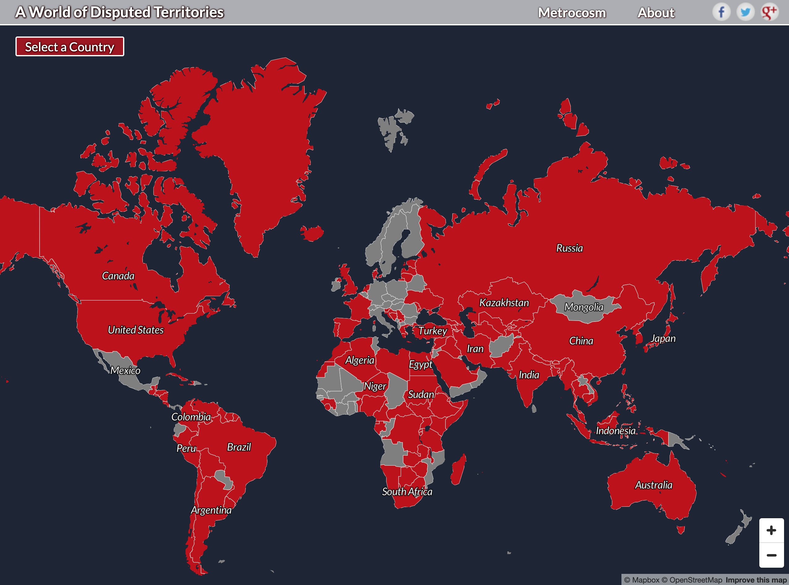

```{r child = "setup.Rmd"}
```

```{r, include=FALSE, eval=TRUE}
library("sf")
library("tidyverse")
library("rnaturalearthdata")
library("mapview")
library("patchwork")
library("leaflet")
library("leaflet.extras")
# remotes::install_github("hrbrmstr/albersusa")
# remotes::install_github("elliottmorris/politicaldata")
library("politicaldata")
library("albersusa")
library("rayshader")
library("threejs")
library("ggtext")
library("janitor")
library("here")
countries_sf <- countries110 %>%
  st_as_sf()

theme_cjh_map <- function(){
  theme_void() +
  theme(panel.background = element_rect(fill = "#98d7ef"), panel.border = element_blank())
}

gg_save_nicely <- function(gg_plot, file_name, width = 10, units = "in"){
  
  gg_internals <- ggplot_build(gg_plot)
  
  x_range <- diff(gg_internals$layout$panel_params[[1]]$x_range)
  y_range <- diff(gg_internals$layout$panel_params[[1]]$y_range)
  
  aspect_ratio <- x_range / y_range
  
  ggsave(file_name,
         gg_plot,
         width = width,
         height = width / aspect_ratio,
         units = units)
  
}
```


class: center, middle, dk-section-title
background-image:url("images/globe-background.jpg")
background-size: contain

# Making maps is complex

---

## R for maps

R has packages for every part of the mapping workflow:

.pull-left[
- importing map data
- wrangling and cleaning map data
- computing geographic distances, areas, intersections and more..
- visualising map data
]

.pull-right[


]

---

## Maps flatten a complex world (I)

```{r eval=TRUE, include=FALSE}
## This code was used to generate the ggplot2 charts that were then shoved
## into PowerPoint and set at the background image
gg_web_mercator <- countries_sf %>%
  ggplot() +
  geom_sf(fill = "#D2B48C") +
  coord_sf(crs = 3857, expand = FALSE) +
  theme_cjh_map()

gg_robinson <- countries_sf %>%
  ggplot() +
  geom_sf(fill = "#D2B48C") +
  coord_sf(crs = "+proj=robin") +
  theme_cjh_map()

gg_pall_peters <- countries_sf %>%
  ggplot() +
  geom_sf(fill = "#D2B48C") +
  coord_sf(crs = "+proj=cea", expand = FALSE) +
  theme_cjh_map()

# gg_web_mercator %>%
#   gg_save_nicely("images/gg_web_mercator.png")
# 
# gg_robinson %>%
#   gg_save_nicely("images/gg_robinson.png")
# 
# gg_pall_peters %>%
#   gg_save_nicely("images/gg_pall_peters.png")
```

.pull-left[
```{r, eval=TRUE, echo=FALSE, out.width="400px"}

earth <- "http://eoimages.gsfc.nasa.gov/images/imagerecords/73000/73909/world.topo.bathy.200412.3x5400x2700.jpg"
globejs(img=earth, 
        atmosphere = TRUE,
        bg = "white",
        width = "400px",
        height = "400px")
```
]

.pull-right[
```{r, eval=TRUE, echo=FALSE}
gg_robinson / gg_web_mercator
```

]

---

.pull-left[
<blockquote class="twitter-tweet"><p lang="en" dir="ltr">Animating the Mercator projection to the true size of each country in relation to all the others.<br><br>Focusing on a single country helps to see effect best.<a href="https://twitter.com/hashtag/dataviz?src=hash&amp;ref_src=twsrc%5Etfw">#dataviz</a> <a href="https://twitter.com/hashtag/maps?src=hash&amp;ref_src=twsrc%5Etfw">#maps</a> <a href="https://twitter.com/hashtag/GIS?src=hash&amp;ref_src=twsrc%5Etfw">#GIS</a> <a href="https://twitter.com/hashtag/projectionmapping?src=hash&amp;ref_src=twsrc%5Etfw">#projectionmapping</a> <a href="https://twitter.com/hashtag/mapping?src=hash&amp;ref_src=twsrc%5Etfw">#mapping</a> <a href="https://t.co/clpCiluS1z">pic.twitter.com/clpCiluS1z</a></p>&mdash; Neil Kaye (@neilrkaye) <a href="https://twitter.com/neilrkaye/status/1050740679008296967?ref_src=twsrc%5Etfw">October 12, 2018</a></blockquote> <script async src="https://platform.twitter.com/widgets.js" charset="utf-8"></script>
]

.pull-right[

Jakub Nowosad replicated this GIF in `{ggplot2}` on their blog: [nowosad.github.io/post/maps-distortion](http://nowosad.github.io/post/maps-distortion)

]

---

## All maps are wrong...

.pull-left[
<iframe width="675" height="406" src="https://www.youtube.com/embed/kIID5FDi2JQ" frameborder="0" allow="accelerometer; autoplay; encrypted-media; gyroscope; picture-in-picture" allowfullscreen></iframe>
]

.pull-right[
All map projections distort the surface of the Earth to some extent.

Some regions or countries may be better represented with specific projections.
]

???


---

### ... but CRS 4326 is a good default

The Coordinate Reference System (CRS) of a geospatial dataset specifies the projection of the dataset.

???

---

### ... but CRS 4326 is a good default

The Coordinate Reference System (CRS) of a geospatial dataset specifies the projection of the dataset.

- WGS84 is the most common [geographic] CRS used in the world.

- It's more usually referred to by the EPSG code 4326

- This "magic number" will appear often in our code

```{r}
quakes %>%
  st_as_sf(coords = c("long", "lat"), crs = 4326) %>%
  mapview()
```


???

---

## Maps flatten a complex world (II)

.pull-left[
<center>

</center>
]

.pull-right[
- There are more than 100 territorial disputes.

- There are more than 30 naming disputes, including seas and other bodies of water.

- Making maps is political, consider your audience and intent.
]
<br>
<br>
Interactive dispute map: [metrocosm.com/disputed-territories-map](http://metrocosm.com/disputed-territories-map.html)

???

---

## Maps flatten a complex world (III)

Base maps (or map tiles) live behind the data we add to our maps and add flavour to the map.

.pull-left[
<center>
```{r, eval=TRUE, echo=FALSE,out.height="200px", out.width="300px"}
leaflet() %>%
  addProviderTiles(providers$Esri.WorldImagery)
```
</center>
]

.pull-right[
<center>
```{r, eval=TRUE, echo=FALSE,out.height="200px", out.width="300px"}
countries_sf %>%
  filter(!name == "Antarctica") %>%
  leaflet() %>%
  addPolygons(fillColor = "white",
              weight = 1,
              fillOpacity = 1,
              color = "black") %>%
  setMapWidgetStyle(list(background= "lightblue"))
```
</center>
]

???

---

## Maps flatten a complex world (III)

.pull-left[
<center>
```{r, eval=TRUE, echo=FALSE,out.height="200px", out.width="300px"}
leaflet() %>%
  addProviderTiles(providers$Esri.WorldImagery)
```

```{r, eval=TRUE, echo=FALSE,out.height="200px", out.width="300px"}
leaflet() %>%
  addProviderTiles(providers$Esri.WorldShadedRelief) %>%
  addMarkers(86.925278, 27.988056, label = "Mount Everest") %>%
  setView(86.925278, 27.988056, zoom = 10)
```
</center>
]

.pull-right[

```{r, eval=TRUE, echo=FALSE,out.height="200px", out.width="300px"}
countries_sf %>%
  filter(!name == "Antarctica") %>%
  leaflet() %>%
  addPolygons(fillColor = "white",
              weight = 1,
              fillOpacity = 1,
              color = "black") %>%
  setMapWidgetStyle(list(background= "lightblue"))
```

```{r, eval=TRUE, echo=FALSE,out.height="200px", out.width="300px"}
leaflet() %>%
  addProviderTiles(providers$OpenStreetMap) %>%
  # addMarkers(31.233333, 30.033333, label = "Samosir") %>%
  setView(31.233333, 30.033333, zoom = 12)
```

]

???


---

## Maps flatten a complex world (IV)

Sometimes the maps we want to build require us to manipulate the relative positions of regions.

.pull-left[
<center>
```{r, eval=TRUE, echo=FALSE, out.width="350px"}
countries_sf %>%
  filter(name == "United States") %>%
  ggplot() +
  geom_sf() +
  theme_cjh_map()
```
</center>
]

.pull-right[
<center>

```{r, include=FALSE}
sf_use_s2(FALSE)
```


```{r, eval=TRUE, echo=FALSE, out.width="350px"}
usa_sf("laea") %>%
  st_union() %>%
  ggplot() +
  geom_sf() +
  theme_cjh_map()
```
</center>
]

???


---

class: center, middle, dk-section-title
background-image:url("images/desk-office-pen-ruler.jpg")
background-size: contain

## Are maps worth it?

???


---

### Choropleth are the gold standard for election data

.pull-left[
```{r, eval=TRUE, echo = FALSE}
data(pres_results)
pres_2016 <- pres_results %>%
  filter(year == 2016) %>%
  mutate(winner = if_else(dem > rep, "Democrat", "Republican"))

usa_sf <- usa_sf()
pres_2016_sf <- usa_sf %>%
  left_join(pres_2016,
            by = c("iso_3166_2" = "state"))

ggplot() +
  geom_sf(data = pres_2016_sf,
          aes(fill = winner)) +
  scale_fill_manual(values = c("Democrat" = "#516DA9",
                               "Republican" = "#FF4A49")) +
  theme_void(base_size = 16) +
  labs(title = "States won by <span style='color:#516DA9'>**Hillary Clinton**</span> and <span style='color:#FF4A49'>**Donald Trump**</span> 
       in the 2016 Presidential race") +
  theme(plot.title = element_textbox_simple()) +
  guides(fill = guide_none())
```
]

.pull-right[
```{r, eval=TRUE, echo=FALSE, fig.dim=c(5, 6.5)}
uk_authority_shp <- read_sf(here("slides", "getting-map-data-into-r", "data", "local-authority-shapefiles"))

referendum_votes <- read_csv("https://data.london.gov.uk/download/eu-referendum-results/52dccf67-a2ab-4f43-a6ba-894aaeef169e/EU-referendum-result-data.csv") 
referendum_votes <- clean_names(referendum_votes)

referendum_votes <- referendum_votes %>%
  select(area_code, area, electorate, votes_cast, valid_votes, pct_remain, pct_leave)


referendum_votes <- referendum_votes %>%
  mutate(result = case_when(pct_remain > pct_leave ~ "Remain",
                            pct_remain < pct_leave ~ "Leave"))

brexit_by_authority <- uk_authority_shp %>%
  dplyr::inner_join(referendum_votes,
                    by = c("lad17cd" = "area_code")) %>%
  select(area, electorate, result, votes_cast, valid_votes, pct_remain, pct_leave, everything())


gg_brexit_by_authority <- brexit_by_authority %>%
  ggplot() +
  geom_sf(aes(fill = result),
          colour = "white",
          lwd = 0.1) +
  scale_fill_manual(values = c("Leave" = "#005ea7", "Remain" = "#ffb632")) +
  theme_void(base_size = 16) +
  labs(title = "Constituencies that voted <span style='color:#005ea7'>**Leave**</span> and <span style='color:#ffb632'>**Remain**</span> in the 2016 Brexit Referendum") +
  theme(plot.title = element_textbox_simple(minwidth = unit(5, "in"),
                                            maxwidth = unit(8, "in"))) +
  guides(fill = guide_none())

gg_brexit_by_authority %>% 
  ggsave(here("slides", "getting-map-data-into-r", "images", "gg_brexit_by_authority.png"),
         .)

gg_brexit_by_authority
```

]

???

---

## Maps show where things happen

<center>
```{r, eval=TRUE, echo=FALSE}
quakes_sf <- quakes %>%
  st_as_sf(coords = c("long", "lat"), crs = 4326) %>%
  mutate(mag = as.numeric(mag)) %>%
  arrange(mag)

pal <- colorNumeric("PRGn", quakes_sf$mag)

label_earthquake <- function(mag, stations){
  paste(
    mag, "on the Richter scale",
    "<br>",
    "Measured by", stations, "stations"
  )
}

quakes_sf %>%
  leaflet() %>%
  addProviderTiles(providers$Esri.OceanBasemap) %>%
  addCircleMarkers(
    fillColor = ~pal(mag),
    # clusterOptions = markerClusterOptions(),
                   radius = ~scales::rescale(mag, c(5, 30)),
    stroke = TRUE,
    weight = 1,
    color = "black",
    fillOpacity = ~scales::rescale(mag, c(0.7, 0.3)),
    popup = ~label_earthquake(mag, stations)
    ) %>%
  addLegend(pal = pal,
            values = ~mag,
            title = "Earthquake magnitude",
            position = "bottomleft")
```
</center>

???

---

## R is a complete GIS system

.pull-left[
Software designed to work with geospatial data is called GIS (Geospatial Information System) software. 

Most dedicated GIS tools are expensive and extremely technical to use.

R is without doubt a complete and powerful GIS system. We can use it to map or manipulate any and all geospatial datasets.
]

```{r eval=FALSE, include=FALSE, echo=FALSE, message=FALSE, warning=FALSE}
rgl::rglwidget()
montereybay %>%
  sphere_shade(texture="desert") %>%
  plot_3d(montereybay,zscale=50)
```
.pull-right[
<br>
<br>
<center>


</center>
]

???


