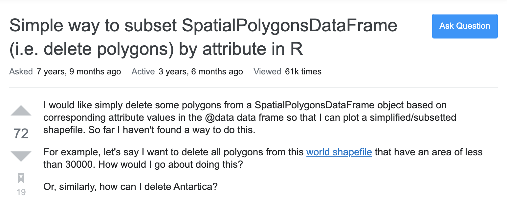

```{r child = "setup.Rmd"}
```

```{r, include=FALSE, eval=TRUE}
library("sf")
library("tidyverse")
library("rnaturalearthdata")
library("mapview")
library("patchwork")
library("leaflet")
library("leaflet.extras")
library("readxl")
library("janitor")
library("stars")

journeys_to_sf <- function(journeys_data,
                           start_long = start.long,
                           start_lat = start.lat,
                           end_long = end.long,
                           end_lat = end.lat) {
  quo_start_long <- enquo(start_long)
  quo_start_lat <- enquo(start_lat)
  quo_end_long <- enquo(end_long)
  quo_end_lat <- enquo(end_lat)

  journeys_data %>%
    select(
      !! quo_start_long,
      !! quo_start_lat,
      !! quo_end_long,
      !! quo_end_lat
    ) %>%
    transpose() %>%
    map(~ matrix(flatten_dbl(.), nrow = 2, byrow = TRUE)) %>%
    map(st_linestring) %>%
    st_sfc(crs = 4326) %>%
    st_sf(geometry = .) %>%
    bind_cols(journeys_data) %>%
    select(everything(), geometry)
}

air_routes_seat_kms <- read_excel("data/air-routes.xlsx",
                                    sheet = "seat-kilometers") %>%
  clean_names()

air_routes_seat_kms <- air_routes_seat_kms %>%
  mutate(across(contains("long"), ~as.numeric(str_trim(.x))))

```

class: center, middle, dk-section-title
background-image:url("images/sf-logo.gif")
background-size: 400px

# {sf} for simple features

???


---

## Most maps contain simple features

.pull-left[
This map shows the **5 busiest passenger routes** in 2015<br>(by total seat kilometres).

It contains three types of feature:

- LINESTRING for the flight routes

- POINT for the airport location

- POLYGON for the country borders
]

.pull-right[

```{r, eval=TRUE, echo=FALSE}
sf_lines_air_routes_seat_kms <- air_routes_seat_kms %>%
  filter(rank <= 5) %>%
  journeys_to_sf(airport_1_long,
                 airport_1_lat,
                 airport_2_long,
                 airport_2_lat) %>%
  st_segmentize(units::set_units(400, km)) %>%
  st_wrap_dateline(options = c("WRAPDATELINE=YES", "DATELINEOFFSET=180"))


part_1 <- air_routes_seat_kms %>%
  filter(rank <= 5) %>%
  select(starts_with("airport_1")) %>%
  rename_with(~str_remove(.x, "airport_1_"))

part_2 <- air_routes_seat_kms %>%
  filter(rank <= 5) %>%
  select(starts_with("airport_2")) %>%
  rename_with(~str_remove(.x, "airport_2_"))

sf_points_air_routes_seat_kms <- part_1 %>%
  bind_rows(part_2) %>%
  unique() %>%
  st_as_sf(coords = c("long", "lat"), crs = 4326)

library("htmltools")
tag.map.title <- tags$style(HTML("
  .leaflet-control.map-title { 
    transform: translate(-50%,20%);
    position: fixed !important;
    left: 50%;
    text-align: center;
    padding-left: 10px; 
    padding-right: 10px; 
    background: rgba(255,255,255,0.75);
    font-weight: bold;
    font-size: 28px;
  }
"))

title <- tags$div(
  tag.map.title, HTML("Top 5 busiest passenger routes in 2015<br>(by total seat kilometres)")
) 

countries_sf <- countries110 %>%
  st_as_sf()

leaflet() %>%
  # addProviderTiles(providers$Esri.WorldStreetMap) %>%
  addPolygons(data = countries_sf %>%
                filter(!name == "Antarctica"),
              fillOpacity = 1,
              fillColor = "tan",
              weight = 1,
              color = "black") %>%
  addPolylines(data = sf_lines_air_routes_seat_kms,
               weight = 2,
               color = "black") %>%
  addCircleMarkers(data = sf_points_air_routes_seat_kms,
                   fillColor = "black",
                   stroke = FALSE,
                   fillOpacity = 1,
                   radius = 5,
                   popup = ~airport) %>%
  # addControl(title, position = "topleft", className="map-title") %>%
  setMapWidgetStyle(list(background= "lightblue"))
```
]

???


---

## {sf} implements simple features for R

- Simple features is a formal standard for organising and processing GIS data.

--

- The `{sf}` package fully implements the simple features standards in R 

--

- The `{sf}` package ultimately provides us with a `data.frame()` like object that we can manipulate with the tidyverse. 

```{r, eval=TRUE, echo=FALSE, df_print="default"}

countries_tib <- countries_sf %>%
  st_drop_geometry() %>%
  as_tibble()

st_geometry(countries_tib) <- countries_sf$geometry

countries_tib %>%
  select(name, continent)
```

???


---

## What can't {sf} do

.pull-left[

The simple features standard does not include raster datasets.

This might include:

- air pollution data
- meteorological data
- satellite imagery

]

.pull-right[
```{r, eval=TRUE, echo=FALSE}
satellite_image <- system.file("tif/L7_ETMs.tif", package = "stars")
satellite_image %>%
  read_stars() %>%
  mapview()
```
]

???

---

## What can't {sf} do

.pull-left[

You'll likely know up front if you're going to work with raster GIS datasets.

We're going to focus on getting vector GIS datasets into R with `{sf}` before introducing `{raster}` and `{stars}` for raster datasets.

]

.pull-right[
```{r, eval=TRUE, echo=FALSE}
satellite_image <- system.file("tif/L7_ETMs.tif", package = "stars")
satellite_image %>%
  read_stars() %>%
  mapview()
```
]

???


---

## (RStudio Coding Slide)

???

---

## {sf} replaces {sp}

.pull-left[
`{sf}` is still a fairly new package, first appearing in 2016.

It is designed to completely replace the older `{sp}` package.

Thankfully, it's very easy to convert `{sp}` objecs to `{sf}`.
]

--

.pull-right[

`{sp}` is responsible for the Spatial*DataFrame data sructure, eg:

- SpatialPolygonsDataFrame
- SpatialPointsDataFrame

]

???


---

## Working with {sp} blogposts/tutorials 

.pull-left[

You have a two choices:

- Use the existing `{sp}` code and convert the final output to an `{sf}` object.

]

.pull-right[

]

???


---

## Working with {sp} blogposts/tutorials 

.pull-left[

You have a two choices:

- Use the existing `{sp}` code and convert the final output to an `{sf}` object.

- Re-write the code to use `{sf}` throughout. **If you figure it out add a solution or write a blogpost!**

]

.pull-right[

]

???


---

## (RStudio Coding Slide)

???

---

class: inverse

### Your turn

Use `mapview()` to visualise only the regions in `tiny_countries110` where the UN region is either "Seven Seas (open ocean)" or "Oceania".

- Load the {tidyverse}, {mapview}, {rnaturalearthdata} and {sf} packages

- Convert `tiny_countries110` into an sf object

- Filter only those countries in "Seven Seas (open ocean)" or "Oceania"

- Visualise this object with {mapview}

