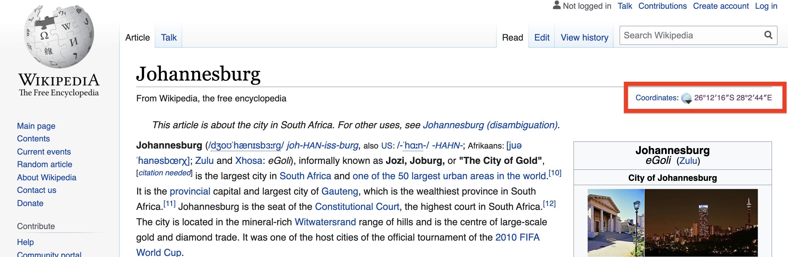
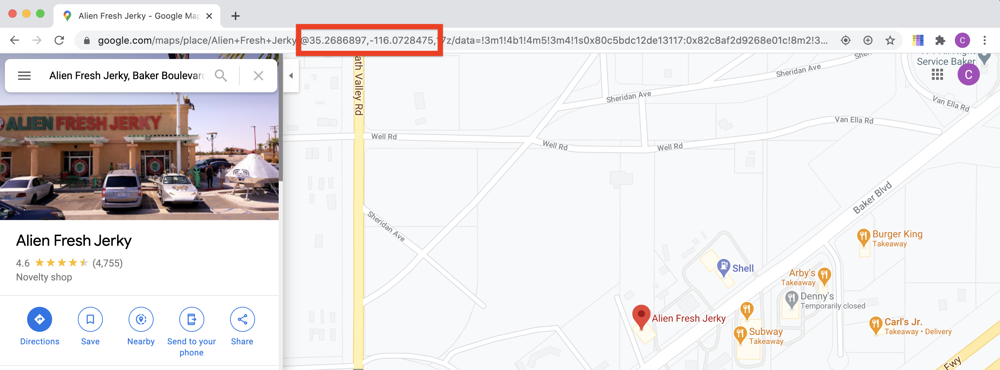

```{r child = "setup.Rmd"}
```

```{r, include=FALSE, eval=TRUE}
library("sf")
library("tidyverse")
library("rnaturalearthdata")
library("mapview")
library("patchwork")
library("leaflet")
library("leaflet.extras")
library("readxl")
library("janitor")
library("stars")
```

class: center, middle, dk-section-title
background-image:url("images/tables-background-image.jpg")
background-size: 100%

# Turning data.frame into {sf} Objects

---

# Where can we get coordinates?

There are many different sources you can use to obtain coordinates for places on Earth.

It's likely that you can use one of the following sources:

- R packages

- Wikipedia

- Google Maps

---

## City coordinates

If you're looking for city coordinates you're in luck:

```{r, eval=TRUE, echo=TRUE}
maps::world.cities
```

---

## Wikipedia pages

Most Wikipedia pages for places contain their coordinates in the summary information.

<a href='https://en.wikipedia.org/wiki/Johannesburg'></a>

---

## Google Maps coordinates

Coordinates can be extracted from Google Maps results via the URL.

They're formatted as: @latitude,longitude,zoom

<a href='https://www.google.com/maps/place/Alien+Fresh+Jerky/@35.2686897,-116.0728475,17z/data=!3m1!4b1!4m5!3m4!1s0x80c5bdc12de13117:0x82c8af2d9268e01c!8m2!3d35.2686897!4d-116.0706588'></a>

---

## (RSTUDIO CODE SLIDE)


---

## Converting address to coordinates

If you've got street addresses you can programmatically convert these to coordinates.

That's covered in the next video.

---

## st_as_sf() makes {sf} objects

The `st_as_sf()` function is used to convert all "foreign" objects into `{sf}` objects, including:

- `{sp}` objects
- data.frames (and tibbles)
- lower level geometry objects

--

For data.frame we need to tell the function which columns contain the coordinates:

```{r}
interesting_places %>%
  st_as_sf(coords = c("long", "lat"))
```

---

## (RSTUDIO CODING SLIDE)

---
class: inverse

## Your turn

Visualise coordinates from an Excel file using `{mapview}`.

- Load up the `01_05` project and run the `airport-locations.R` script.

- Use `st_as_sf()` to convert the `tibble` into an `sf` object

- Visualise the coordinates with `{mapview}`

