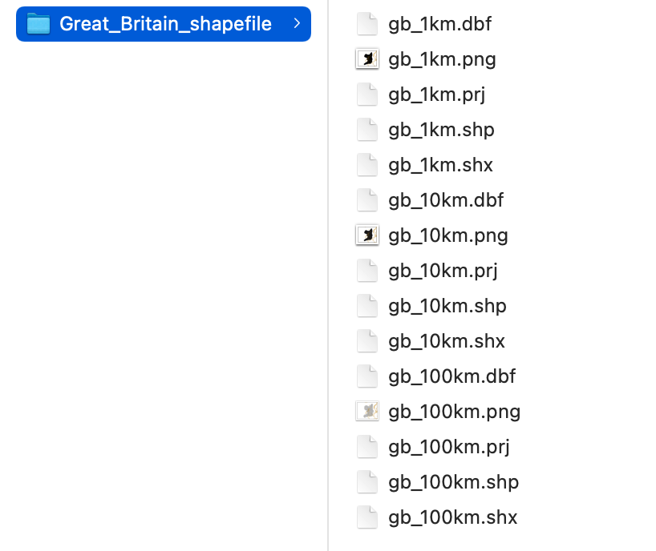

```{r child = "setup.Rmd"}
```

```{r, include=FALSE, eval=TRUE}
library("sf")
library("tidyverse")
library("rnaturalearthdata")
library("mapview")
library("patchwork")
library("leaflet")
library("leaflet.extras")
library("readxl")
library("janitor")
library("stars")
library("emo")
```

class: center, middle, dk-section-title
background-image:url("images/import-shipping-containers.jpeg")
background-size: 100%

# Importing shapefiles

???


---

## Shapefiles and choropleth

.pull-left[

The data that give choropleth (and other maps) their shapes come from **shapefiles**.

You can't start building a choropleth before you find appropriate shapefiles.

]

.pull-right[
```{r, eval=TRUE,echo=FALSE, out.height="400px"}
countries_sf <- countries110 %>%
  st_as_sf() %>%
  filter(!continent == "Antarctica")

pal_continents <- colorFactor("Set2", countries_sf$continent)

countries_sf %>%
  leaflet() %>%
  addPolygons(fillColor = ~pal_continents(continent),
              fillOpacity = 1,
              weight = 1,
              color = "black") %>%
  addLegend(pal = pal_continents,
            values = ~continent,
            opacity = 1)
```
]

???

---

## Shapefiles and {sf}

.pull-left[

We import shapefiles into R with `sf::read_sf()`

Shapefiles produce `{sf}` objects that contain MULTIPOLYGONs.

]

.pull-right[
```{r, eval=TRUE,echo=FALSE, out.height="400px"}
countries_sf <- countries110 %>%
  st_as_sf() %>%
  filter(!continent == "Antarctica")

pal_continents <- colorFactor("Set2", countries_sf$continent)

countries_sf %>%
  leaflet() %>%
  addPolygons(fillColor = ~pal_continents(continent),
              fillOpacity = 1,
              weight = 1,
              color = "black") %>%
  addLegend(pal = pal_continents,
            values = ~continent,
            opacity = 1)
```
]

???

---

## Shapefile formats

There are *many* different formats for storing shapefiles.

The **most common and most awkward** format you'll come across are ESRI shapefiles.


---

## ESRI Shapefiles

ESRI shapefiles are downloaded as .zip files that you must uncompress.

.pull-left[

ESRI shapefiles must contain at least these files: 

- .shp
- .shx
- .dbf

The .zip might contain *multiple layers*.

]


.pull-right[

]


???

---

## Data sources for this video

We're going to demonstrate two sets of shapefiles in the 01_06 RStudio project.

.pull-left[

**Counties in England and Wales**

This was downloaded from [here](https://data.gov.uk/dataset/0f93351a-514a-4ccd-80ea-d727427c63b0/counties-and-unitary-authorities-december-2015-generalised-clipped-boundaries-in-england-and-wales) and contains a **single layer**.

]

.pull-left[

**US 2020 Census Self-Response**

This was downloaded from [here](https://www.gc.cuny.edu/Page-Elements/Academics-Research-Centers-Initiatives/Centers-and-Institutes/Center-for-Urban-Research/CUR-research-initiatives/Census-2020/Census-2020-Self-Response-Data-Questions-and-Answers) and contains **multiple layers**.

]

---

## (RStudio Code Slide)

???

