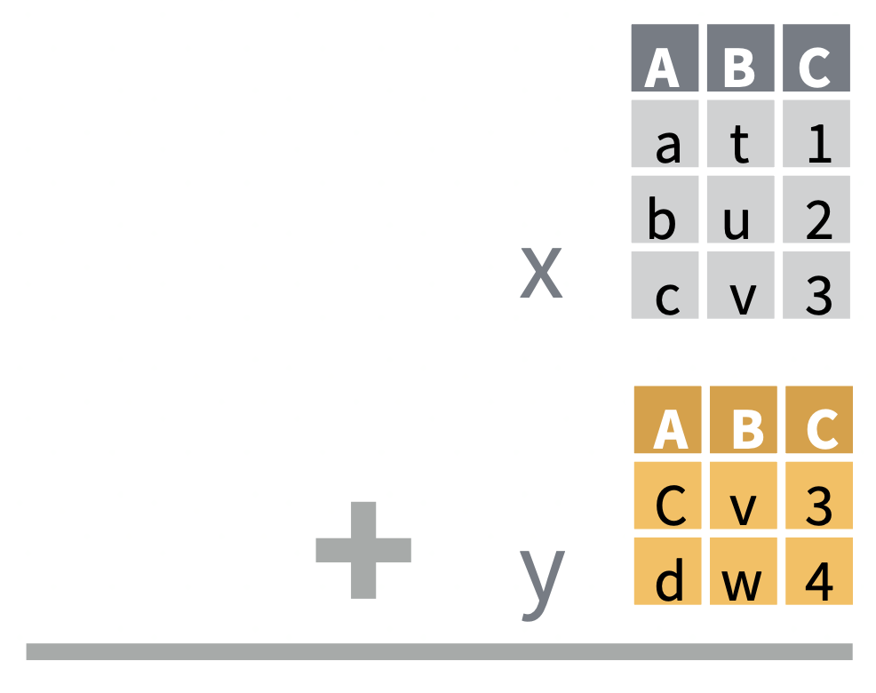
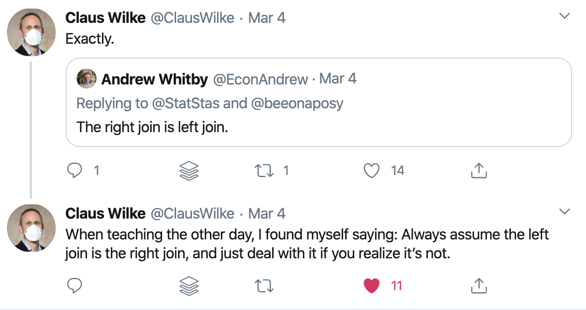

```{r child = "setup.Rmd"}
```

```{r, include=FALSE, eval=TRUE}
library("sf")
library("tidyverse")
library("rnaturalearthdata")
library("mapview")
library("patchwork")
library("leaflet")
library("leaflet.extras")
library("readxl")
library("janitor")
library("stars")
library("emo")
```

class: center, middle, dk-section-title
background-image:url("images/rows-of-sweets.jpeg")
background-size: 100%

# Joining Geospatial Datasets

???


---

## Bind or join?

There are two different ways to combine datasets using the `{dplyr}` package.

.pull-left[

**Binding** datasets combines tables by the **position** of rows.

<!-- `bind_rows(data_x, data_y)` appends the rows from `data_y` to the bottom of `data_x`. -->

<!-- `bind_cols(data_x, data_y)` apeands the columns from `data_y` to the right of `data_x`. -->
<center>

</center>

]

.pull-right[

**Joining** datasets combines tables by the **values** in rows.
<center>

</center>
]

???

There are two different methods for combining rectangular datasets together - binding and joining. Both of these tools come from within the tidyverse, and specifically the dplyr package.

Binding and joinng are required for different situations and solve different problems and we're going to cover a few examples of each in this video.

Binding datasets combines tables by the position of rows, for instance bind_rows() which appeends the rows from table y onto the bottom of table x.

Joining is more complex and combines tables by the values found in the rows of each table - let's take a look at how these functions work.

---

## "Mutating joins"

.pull-left[

The `{dplyr}` documentation includes one page called "mutate-joins" that covers four **different kinds of join**:

- `left_join()`
- `right_join()`
- `inner_join()`
- `full_join()`


]

--

.pull-right[

`{tidyexplain}` contains GIF that [explain each of these graphically](https://www.garrickadenbuie.com/project/tidyexplain/):

<center>

</center>
]

???


---

## More about mutating joins...

.pull-left[

`left_join()` is the most common (and usually correct) join.


]

.pull-right[
Learn more about the mechanics of joining on R for the Rest of Us.


]

???

---

## Joining sf objects

Always place the {sf} dataset in the first argument of the join functions:

```{r}
uk_sf <- read_sf("data/shapefiles")
uk_population <- read_csv("data/uk_population.csv")
```


| Example Join | Keeps geometery? |
| :-- | :--: |
| `left_join(uk_sf, uk_population)` | `r emo::ji("white_check_mark")` |
| `left_join(uk_population, uk_sf)` | `r emo::ji("x")` |
| `right_join(uk_sf, uk_population)` | `r emo::ji("white_check_mark")` |
| `right_join(uk_population, uk_sf)` | `r emo::ji("x")` |


???


---

## One last thing...

.pull-left[
In the documentation the two arguments of all the joins and binding functions are named `x` and `y`:

- `left_join(x, y)`
- `right_join(x, y)`
- `full_join(x, y)`
- `inner_join(x, y)`
- `bind_cols(x, y)`
- `bind_rows(x, y)`


]

.pull-right[
You might prefer to think of them as the **left-hand side** and **right-hand side** of the joins.
]

???


---

class: my-turn

## My Turn

I'm going to show how to use `left_join()` to combine datasets from the `{gapminder}` and `{rnaturalearthdata}` datasets.

I'll then show you how to bind multiple `{sf}` objects together.

???

---

## (RStudio Coding Slide)

???

  
---

class: inverse

## Your Turn

Use `mapview()` to visualise the results of the Brexit Referendum by combining shapefiles with the a .csv file containing the results.


- Combine together the shapefiles for England, Scotland and Wales with `bind_rows()`

- Import the referendum results .csv file

- Use `left_join()` to join the UK shapefiles with the referendum results

- Use `mapview(zcol = "results")` to visualise the shapefiles after joining