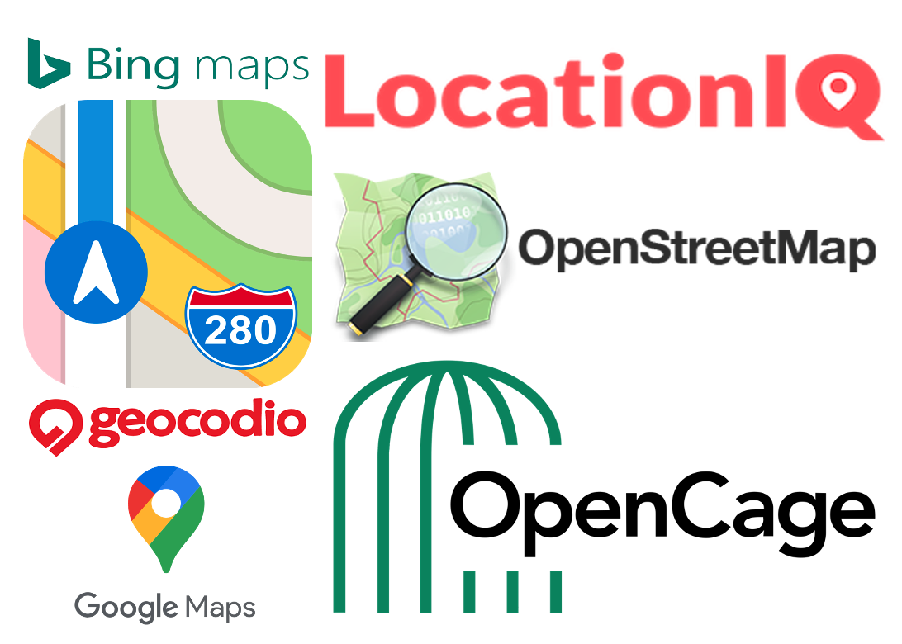

```{r child = "setup.Rmd"}
```

```{r, include=FALSE, eval=TRUE}
library("sf")
library("tidyverse")
library("rnaturalearthdata")
library("mapview")
library("patchwork")
library("leaflet")
library("leaflet.extras")
library("readxl")
library("janitor")
library("stars")
library("emo")
library("DT")
library("glue")
```

class: center, middle, dk-section-title
background-image:url("images/street-sign.jpeg")
background-size: 100%

# Converting addresses to coordinates

???


---

## Addresses are messy 

Street addresses are extremely messy and very *human* datasets.

--

.pull-left[
Addresses can refer to many different things:

- A building

- A floor in a building

- A collection of buildings

- A city/town/province or other region
]

--

.pull-right[

Additionally:

- Addresses are often incomplete

- Addresses vary significantly internationally

]


???


---

## Geocoding: Forwards & Reverse

Geocoding is the process of converting between addresses and geographic coordinates.

- **Forward geocoding** *attempts* to converts an address into coordinates.

- **Reverse geocoding** *attempts* converts coordinates into an address.

???


---

## Geocoding packages

There are **several** packages that provide geocoding services - because there are multiple **commercial** geocoding services.

<center></center>

???

---

## `{ggmaps}`

Before June 2018 the most obvious and best package for geocoding was `{ggmaps}`:

- It used Google's industry leading Google Maps API

- It was free and easy to use

???


---

## `{ggmaps}`

Before June 2018 the most obvious and best package for geocoding was `{ggmaps}`:

- It used Google's industry leading Google Maps API

- It was free and easy to use

Nowadays you **must** provide Google with your **credit card details** to use this service.

- Currently you are provided $200 free credits per month

- Refer to Google's pricing pages for up to date details: [cloud.google.com/maps-platform/pricing](https://cloud.google.com/maps-platform/pricing)

???


---

## `{tidygeocoder}`

I strongly recommend using `{tidygeocoder}` for all your forward geocoding needs.

The package rolls together a total of **four** different geocoding services - but we only care about two of them.

???


---

## `{tidygeocoder}`

```{r, echo=FALSE, eval=TRUE}
tidygeocoder_tibble <- tribble(
  ~geocode_service, ~img_path, ~requires_billing, ~details,
  "LocationIQ", "images/locationiq-logo.png", emo::ji("x"), "The free tier allows 5,000 requests/day and can be used commercially.",
  "OpenStreetMap", "images/openstreetmap-logo.png", emo::ji("x"), "OpenStreetMap provide an always free geocoding service called <b>Nominatim</b>.<br>It's <b>not</b> designed for commercial usage, see the <a href='https://operations.osmfoundation.org/policies/nominatim/'>Usage Policy</a> for more details."
)

tidygeocoder_tibble %>% 
  mutate(img_path = glue("")) %>% 
  select(img_path:details) %>% 
  datatable(escape = FALSE,
            colnames = c("Geocoding service", "Requires billing details?", "Details"),
            rownames = FALSE,
            height = "320px",
            options = list(
              dom = "t",
              columnDefs = list(list(className = 'dt-center', 
                                     targets = 1),
                                list(width = "200px",
                                     targets = 1))
            ))
```

???

---

class: my-turn

## My Turn

I'll import and geocode the addresses in the UK Addresses tab of our Excel file.

???


---

# (RSTUDIO CODING SLIDE)

???


---

## Environmental Variables 

One of the most flexible ways to **permanently** store API keys on your machine.

The file is most easily manipulated with the `{usethis}` package:

```{r, eval=FALSE}
usethis::edit_r_environ()
```

???


---

## .Renviron 

Variables are stored in the file as key-value pairs:

> LOCATIONIQ_API_KEY=KEY
>
> OTHER_API_KEY=KEY
>
> &zwnj;

The file **must** end with an empty line <span style="color:red">or it won't work</span>.

???


---

# (RSTUDIO CODING SLIDE)

???


---

class: inverse

## Your Turn

Convert the addresses in the "International Addresses" worksheet into coordinates and visualise them.

1. Import the "International Addresses" worksheet

1. Re-use the `mutate(across(...))` code to remove NA values

1. Combine together `address_line_1`, `address_line_2`, `address_line_3` into `full_address`

1. Use `geocode()` to convert the addresses into coordinates

1. Visualise the locations with `{mapview}`


