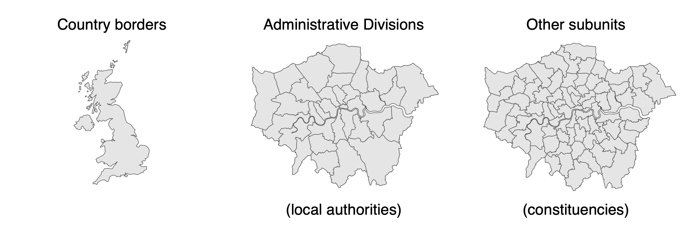
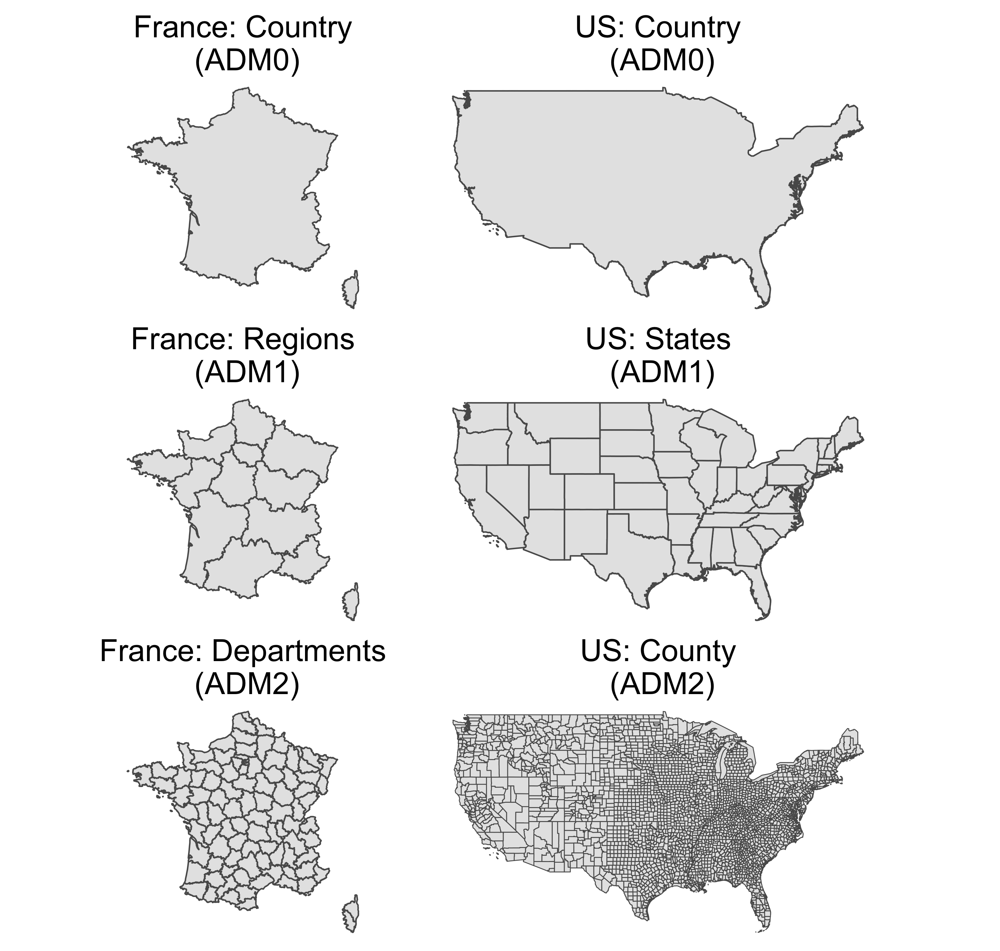
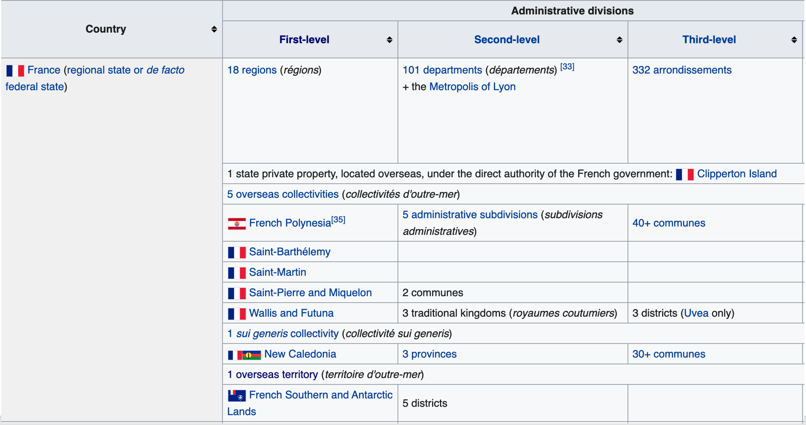
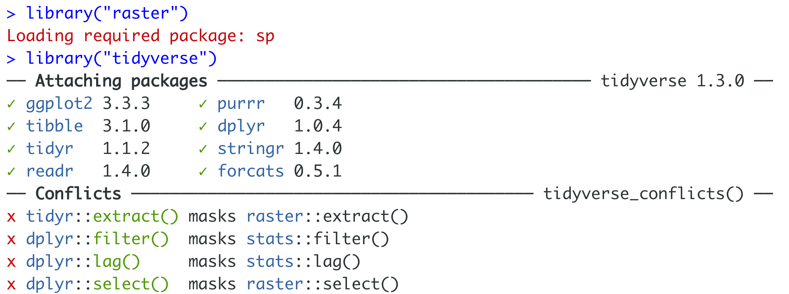

```{r child = "setup.Rmd"}
```

```{r, include=FALSE, eval=TRUE}
library("sf")
library("tidyverse")
library("mapview")
library("patchwork")
library("janitor")
library("tigris")
library("tidycensus")
library("here")
library("patchwork")
```

class: center, middle, dk-section-title
background-image:url("images/united-nations.jpeg")
background-size: 100%

# Advice on finding international datasets

???


---

# What kind of geoboundary do you need?

```{r, echo=FALSE}
library("rnaturalearthdata")
uk_sf <- countries50 %>% 
  st_as_sf() %>% 
  filter(name == "United Kingdom")

gg_uk <- ggplot() +
  geom_sf(data = uk_sf) +
  theme_void()

london_boroughs_sf <- read_sf(here("slides", "getting-map-data-into-r", "data", "london_boroughs.geojson"))
london_constituencies_sf <- read_sf(here("slides", "getting-map-data-into-r", "data", "london_constituencies.geojson"))

gg_boroughs <- ggplot() +
  geom_sf(data = london_boroughs_sf) +
  theme_void()

gg_consituencies <- ggplot() +
  geom_sf(data = london_constituencies_sf) + 
  theme_void()

gg_uk + gg_boroughs + gg_consituencies

```



???


---

### Country borders: `{rnaturalearthdata}`

.pull-left[
```{r, eval=FALSE}
library("rnaturalearthdata")
countries110 %>% 
  st_as_sf() %>% 
  select(name, continent) %>%
  mapview()
```
- It's available on CRAN

- It's quick and easy to use

]

.pull-right[
```{r, eval=TRUE, echo=FALSE}
library("rnaturalearthdata")
countries110 %>% 
  st_as_sf() %>% 
  select(name, continent) %>%
  mapview()
```
]

???

---

### Country borders: `{rnaturalearthdata}`

.pull-left[
There are two datasets included:

- `countries110`: scale of 1:110m

- `countries50`: scale of 1:50m
]

.pull-right[

```{r gg-uk-110, eval=TRUE, echo=FALSE, out.width='80%'}
gg_uk_110 <- countries110 %>% 
  st_as_sf() %>% 
  select(name, continent) %>% 
  filter(name == "United Kingdom") %>% 
  ggplot() +
  geom_sf() +
  theme_void(base_size = 20) +
  labs(title = "countries110") +
  theme(plot.title = element_text(hjust = 0.5))

gg_uk_50 <- countries50 %>% 
  st_as_sf() %>% 
  select(name, continent) %>% 
  filter(name == "United Kingdom") %>% 
  ggplot() +
  geom_sf() +
  theme_void(base_size = 20) +
  labs(title = "countries50") +
  theme(plot.title = element_text(hjust = 0.5))

gg_uk_110 + gg_uk_50 
```

]

???


---

### `{rnaturalearthhires}`

1:10m country shapefiles are too large to fit in a CRAN package.

```{r, eval=FALSE}
remotes::install_github("ropensci/rnaturalearthhires")
```

<center>
```{r, eval=TRUE, echo=FALSE, out.height='350px'}
library("rnaturalearthhires")
gg_uk_10 <- countries10 %>% 
  st_as_sf() %>% 
  filter(NAME == "United Kingdom") %>% 
  ggplot() +
  geom_sf() +
  theme_void(base_size = 20) +
  labs(title = "countries10") +
  theme(plot.title = element_text(hjust = 0.5))


gg_uk_50 + gg_uk_10
```
</center>

???


---

## Administrative divisions

.pull-left[
Administrative divisions are standardised hierarchical country subdivisions as defined in ISO 3166-2.

There are [more than 30 different national subdivision names](https://en.wikipedia.org/wiki/Administrative_division#Examples_of_administrative_divisions).

]

.pull-right[
```{r, eval=FALSE, echo=FALSE}
# france_adm0 <- getData(country = "FRA", level = 0) %>%
#   st_as_sf() %>%
#   ms_simplify() 
# france_adm1 <- getData(country = "FRA", level = 1) %>%
#   st_as_sf() %>% 
#   ms_simplify()
# france_adm2 <- getData(country = "FRA", level = 2) %>%
#   st_as_sf() %>% 
#   ms_simplify()
# france_adm3 <- getData(country = "FRA", level = 3) %>%
#   st_as_sf() %>% 
#   ms_simplify()
# 
# us_adm1 <- getData(country = "USA", level = 1) %>%
#   st_as_sf() %>%
#   filter(!NAME_1 %in% c("Alaska", "Hawaii")) %>%
#   ms_simplify()
# 
# us_adm0 <- us_adm1 %>%
#   st_union()
# 
# us_adm2 <- getData(country = "USA", level = 2) %>%
#   st_as_sf() %>%
#   filter(!NAME_1 %in% c("Alaska", "Hawaii")) %>%
#   ms_simplify()
# 
# theme_adm_map <- function(){
#   
#   theme_void() +
#     theme(plot.title = element_text(hjust = 0.5, size = 18))
#   
# }
# 
# gg_france_adm0 <- france_adm0 %>% 
#   ggplot() +
#   geom_sf() +
#   theme_adm_map() +
#   labs(title = "France: Country\n (ADM0)")
# 
# 
# gg_france_adm1 <- france_adm1 %>% 
#   ggplot() +
#   geom_sf() +
#   theme_adm_map() +
#   labs(title = "France: Regions\n (ADM1)")
# 
# gg_france_adm2 <- france_adm2 %>% 
#   ggplot() +
#   geom_sf() +
#   theme_adm_map() +
#   labs(title = "France: Departments\n (ADM2)")
# 
# gg_us_adm0 <- us_adm0 %>% 
#   ggplot() +
#   geom_sf() +
#   theme_adm_map() +
#   labs(title = "US: Country\n (ADM0)")
# 
# gg_us_adm1 <- us_adm1 %>% 
#   ggplot() +
#   geom_sf() +
#   theme_adm_map() +
#   labs(title = "US: States\n (ADM1)")
# 
# gg_us_adm2 <- us_adm2 %>% 
#   ggplot() +
#   geom_sf(size = 0.3) +
#   theme_adm_map() +
#   labs(title = "US: County\n (ADM2)")
# 
# gg_vert_administrative_regions <- (gg_france_adm0 + theme(plot.margin = unit(c(0,45,0,0), "pt"))  + gg_us_adm0) / 
#   (gg_france_adm1 + theme(plot.margin = unit(c(0,45,0,0), "pt")) + gg_us_adm1) / 
#   (gg_france_adm2 + theme(plot.margin = unit(c(0,45,0,0), "pt")) + gg_us_adm2)
# 
# ggsave("gg_vert_administrative_regions.png", gg_vert_administrative_regions, width = 10)
```


]

???

---

### Administrative divisions: territories

.pull-left[
Administrative divisions names are often non-uniform at multiple levels.

This is an artefact of colonialism.

This can complicate data analysis and visualisation.
]

.pull-right[

]

???

---


### Administrative divisions: what are they good for?

.pull-left[
Administrative divisions are used for different things in different countries.
]

.pull-right[
These might include:

- Local governmental authorities

- Regional collections of local authorities

- Electoral regions

- Postal regions
]

???


---

### Administrative divisions:   `raster::getData()`

`raster::getData()` provides access to all available administrative divisions from the GADM dataset.

<hr>

.pull-left[
Load the `{raster}` package **before** loading the `{tidyverse}`

```{r, eval=FALSE}
library("raster")
library("tidyverse")
```
]

.pull-right[

]

???


---

### RStudio Coding Slide:


???

---

## Other subunits

.pull-left[
You'll often find maps you want to make require other country subunits.
]

.pull-right[
```{r, eval=TRUE, echo=FALSE, fig.dim=c(5, 6.5)}
uk_authority_shp <- read_sf("data/local-authority-shapefiles")

referendum_votes <- read_csv("https://data.london.gov.uk/download/eu-referendum-results/52dccf67-a2ab-4f43-a6ba-894aaeef169e/EU-referendum-result-data.csv") 
referendum_votes <- clean_names(referendum_votes)

referendum_votes <- referendum_votes %>%
  select(area_code, area, electorate, votes_cast, valid_votes, pct_remain, pct_leave)


referendum_votes <- referendum_votes %>%
  mutate(result = case_when(pct_remain > pct_leave ~ "Remain",
                            pct_remain < pct_leave ~ "Leave"))

brexit_by_authority <- uk_authority_shp %>%
  dplyr::inner_join(referendum_votes,
                    by = c("lad17cd" = "area_code")) %>%
  select(area, electorate, result, votes_cast, valid_votes, pct_remain, pct_leave, everything())
library("ggtext")

brexit_by_authority %>%
  ggplot() +
  geom_sf(aes(fill = result),
          colour = "white",
          lwd = 0.1) +
  scale_fill_manual(values = c("Leave" = "#005ea7", "Remain" = "#ffb632")) +
  theme_void(base_size = 16) +
  labs(title = "Constituencies that voted <span style='color:#005ea7'>**Leave**</span> and <span style='color:#ffb632'>**Remain**</span> in the 2016 Brexit Referendum") +
  theme(plot.title = element_textbox_simple(minwidth = unit(5, "in"),
                                            maxwidth = unit(8, "in"))) +
  guides(fill = guide_none())
```
]

???

---

### Census Offices / Statistics Offices

Often shapefiles can be found in a natianal Census Office or in a Statistics Office.

There are two good sources for these offices:

- Wikipedia's [list of National & International Statistical Services](https://en.wikipedia.org/wiki/List_of_national_and_international_statistical_services).

- The UN's Statistical Division [list of national statistics offices](https://unstats.un.org/home/nso_sites/)

???


---

### Country and local authority data portals

[DataPortals.org](https://dataportals.org/search) claims to be the most comprehensive list of **Open Data** portals - with 590+ portals listed.

???

---

## Geoboundaries change over time

All of the boundaries that we've discussed are liable to change (potentially drastically) over time.

- `{rnaturalearthdata}` is expected to keep up to date with changes on the [naturalearthdata.com]() service.

- `raster::getData()` connects to GADM which is actively kept up to date

- You're responsible for finding up-to-date (or historical!) data for other subunits.

???


