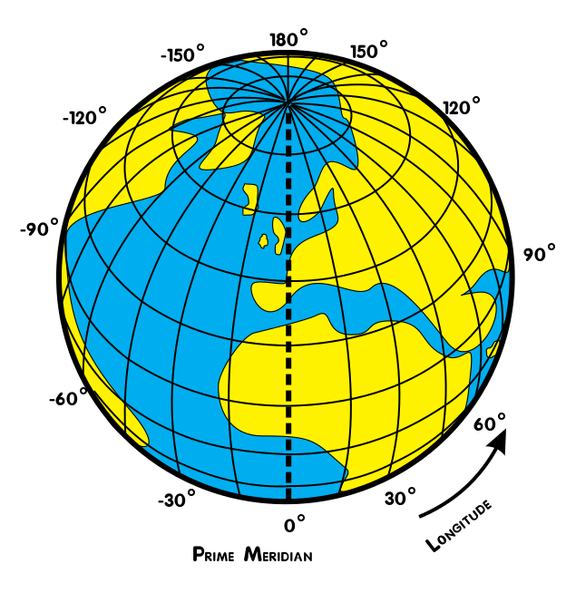
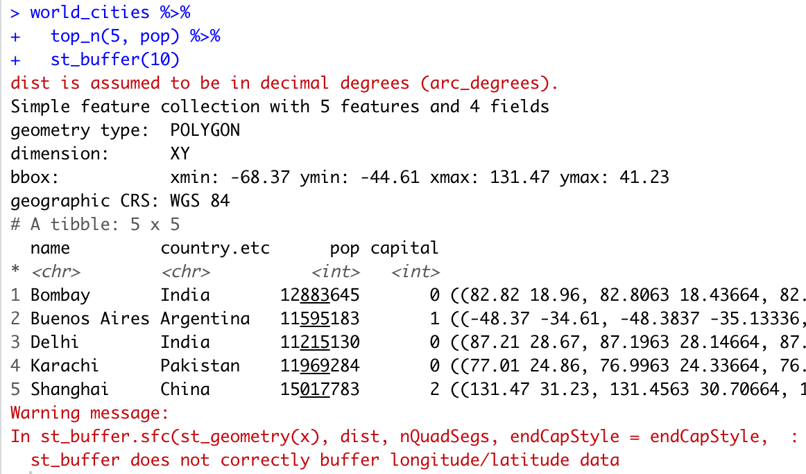

```{r child = "setup.Rmd"}
```

```{r, include=FALSE, eval=TRUE}
library("sf")
library("raster")
library("tidyverse")
library("maps")
library("rnaturalearthdata")
library("mapview")
library("patchwork")
library("leaflet")
library("leaflet.extras")
library("readxl")
library("janitor")
library("stars")
library("emo")
library("tigris")
library("tidycensus")
library("rmapshaper")
library("patchwork")
```

class: center, middle, dk-section-title, contain
background-image:url("images/impossible-shapes.png")
background-size: 80%

# CRS & Projections: Geographic vs Projected CRS

???


---

## All maps are wrong...

.pull-left[
<iframe width="675" height="406" src="https://www.youtube.com/embed/kIID5FDi2JQ" frameborder="0" allow="accelerometer; autoplay; encrypted-media; gyroscope; picture-in-picture" allowfullscreen></iframe>
]

.pull-right[

To squash the surface of the Earth onto a map we need to **project** from a sphere's surface to a 2D flat map.

]

???


---

## Geographic CRS vs Projected CRS

.pull-left[

**Geographic CRS** (including 4326)

- Points are specified as longitudes and latitudes.

- Distances are measured in non-physical units: degrees.

]

--

.pull-right[

**Projected CRS**

- Points are specified as (x, y) coordinates.

- Distances are measured in **physical units**, e.g. metres. 

]

???

---

## Geographic CRS vs Projected CRS

.pull-left[

**Geographic CRS** (including 4326)

- Points are specified as longitudes and latitudes.

- Distances are measured in non-physical units: degrees.

Used for **visualisations**.

]

.pull-right[

**Projected CRS**

- Points are specified as (x, y) coordinates.

- Distances are measured in **physical units**, e.g. metres. 

Used for **geometric calculations and GIS analysis**. 

]

???


---

### mapview needs a CRS to work

.pull-left[

```{r, eval=TRUE, echo=TRUE, out.height='250px'}
quakes_no_crs <- quakes %>% 
  st_as_sf(coords = c("long", "lat"))
quakes_no_crs %>% mapview()
```

]

.pull-right[

```{r, eval=FALSE, echo=TRUE, out.height='250px'}
quakes_4326_crs <- quakes %>% 
  st_as_sf(coords = c("long", "lat"), 
*          crs = 4326)
quakes_4326_crs %>% mapview()
```

```{r, eval=TRUE, echo=FALSE, out.height='250px'}
quakes_4326_crs <- quakes %>% 
  st_as_sf(coords = c("long", "lat"), 
           crs = 4326)
quakes_4326_crs %>% mapview()
```

]

???

---

### CRS codes are EPSG codes

CRS 4326 is the **E**uropean **P**etroleum **S**urvey **G**roup (EPSG) code 4326.

[EPSG.io](https://epsg.io) makes it simple to find EPSG codes.

--

<br>

> Unfortunately, not all CRS have an EPSG code

???

---

## CRS vs WKT

Only a small subset of possible Coorodinate Reference Systems *have* "CRS codes".

The most general purpose and flexible way to refer to (and store) projections is in the **Well-Known Text (WKT)** representation.

???


---

### WKT include all the complexity of GIS systems (I)

.pull-left[

We're smoothing over a lot of complicated mathematics required to build CRS. 

The benefit of using WKT is that they can fully describe all of the details required for more complex GIS you or your colleagues might do in the future.

]

.pull-right[


Image credit: [desktop.arcgis.com/en/arcmap/10.3/guide-books/map-projections/datums](desktop.arcgis.com/en/arcmap/10.3/guide-books/map-projections/datums).

]

---

### WKT include all the complexity of GIS systems (II)

.pull-left[

WKT can be recognised by the following features:

- Most WKT examples you'll use begin with `GEODCRS` or `PROJCS`.

- It contains nested square brackets

]

.pull-right[

```{r}
GEOGCS["WGS 84",
    DATUM["WGS_1984",
        SPHEROID["WGS 84",6378137,298.257223563,
            AUTHORITY["EPSG","7030"]],
        AUTHORITY["EPSG","6326"]],
    PRIMEM["Greenwich",0,
        AUTHORITY["EPSG","8901"]],
    UNIT["degree",0.0174532925199433,
        AUTHORITY["EPSG","9122"]],
    AUTHORITY["EPSG","4326"]]
```


]

---

### RStudio Coding Slide

???


---

## Don't use geographic CRS for analysis

.center[
```{r, eval=TRUE, echo=FALSE, fig.asp = 0.6, out.height='400px', dpi=150}
sf_use_s2(FALSE)
world_cities <- world.cities %>% 
  as_tibble() %>% 
  st_as_sf(coords = c("long", "lat"),
           crs = 4326)

city_circles_4326 <- world_cities %>% 
  top_n(10, pop) %>% 
  st_buffer(1000E3 / 111320)

world_sf <- countries110 %>% 
  st_as_sf() %>% 
  filter(name != "Antarctica")

gg_crs_4326_circles <- ggplot() +
  geom_sf(data = world_sf) +
  geom_sf(data = city_circles_4326,
          alpha = 0.4,
          fill = "red",
          colour = "red") +
  coord_sf(crs = 3395) +
  theme_void()
gg_crs_4326_circles
```
]

???

---

### Distance metrics are complicated in CRS 4326

.pull-left[
Distances between points in geographic CRS are measured in degrees of **longitude** and **latitude**.


This globe shows the longitude lines (meridians) centred on the Prime Meridian in London.

]

.pull-right[

]

???

---

### Distance metrics are complicated in CRS 4326

```{r, echo=FALSE, eval=TRUE}
a_constant <- 6378137.0
b_constant <- 6356752.3142
e_squared_constant <- {{a_constant^2 - b_constant^2} / a_constant^2}^2

deg2rad <- function(deg) {(deg * pi) / (180)}

wiki_arc_length <- function(latitude){
  {pi * a_constant * cos(latitude)} /
    180 * sqrt(1 - e_squared_constant * sin(latitude)^2)
}

degree_at_equator <- round(wiki_arc_length(deg2rad(0)) / 1000, 2)

degree_at_moscow <- round(wiki_arc_length(deg2rad(55.755833)) / 1000, 2)
```

.pull-left[
The distance between the longitude lines **varies** greatly dependent on how far points are away from the equator.

- At the equator a degree of longitude is `r degree_at_equator` km.

- Moscow is at a latitude 55 where a degree of longitude is `r degree_at_moscow` km.
]

.pull-right[

]

.footnote[
For the mathematics behind these calculations [see here](https://en.wikipedia.org/wiki/Longitude#Length_of_a_degree_of_longitude).
]

???

---

### Geographic CRS distort GIS operations

.pull-left[

]

.pull-right[
```{r, eval=TRUE, echo=FALSE, fig.asp = 0.6, out.height='400px', dpi=150}
gg_crs_4326_circles
```
]

???


---

### `{sf}` has your back

.pull-left[

`{sf}` will warn you about misusing geographic CRS


]

.pull-right[

`st_is_longlat()` will return TRUE for geographic CRS.

```{r, eval=TRUE}
world_cities %>% 
  st_is_longlat()
```

]

???


