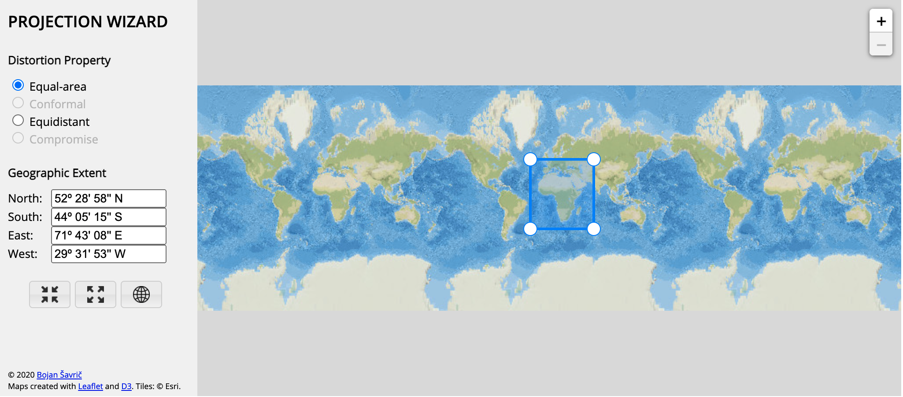
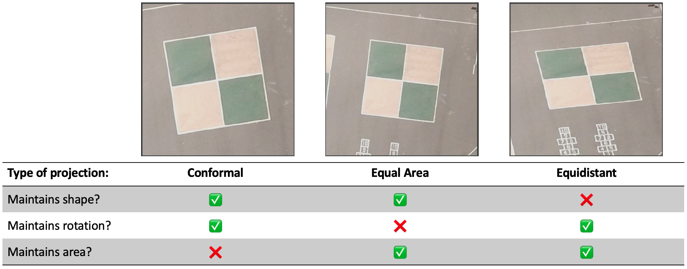

```{r child = "setup.Rmd"}
```

```{r, include=FALSE, eval=TRUE}
library("sf")
library("raster")
library("tidyverse")
library("maps")
library("rnaturalearthdata")
library("mapview")
library("patchwork")
library("leaflet")
library("leaflet.extras")
library("readxl")
library("janitor")
library("stars")
library("emo")
library("tigris")
library("tidycensus")
library("rmapshaper")
library("patchwork")
```

class: center, middle, dk-section-title, contain
background-image:url("images/impossible-shapes.png")
background-size: 80%

# CRS & Projections: How to choose a CRS

???


---
class: middle, contain

.pull-left[
<br>
This video gets into the technical details of finding a **suitable** projected CRS.

This is only a concern for geocomputations and GIS analysis - for straightforward mapping you can use our magic CRS - 4326.
]

.pull-right[

]

???


---

## There are no all-purpose CRS

> “There exist no all-purpose projections, all involve distortion when far from the center of the specified frame” (Bivand, Pebesma, and Gómez-Rubio 2013)

???

---

## National Mapping Agencies to the rescue

If your data lie within country borders then you can take advantage of CRS specifically designed by *National Mapping Agencies*.

These agencies create nation-level CRS that allow precision...

- ... national infrastructe planning.

- ... cellular network coverage.

- ... coastal erosion monitoring.

- ... weather forecasting.

- ... maps for civilian, government and military uses.


???


---

### Governments usually supply data in national CRS

GIS datasets obtained from government data portals are usually provided in the national CRS - for instance [geoportal.statistics.gov.uk](https://geoportal.statistics.gov.uk/datasets/local-authority-districts-may-2020-boundaries-uk-bfe).

We can then use `st_crs()` and `st_transform()` to project other datasets into the national CRS.

```{r}
national_gis_dataset <- read_sf("data/shapefiles")
your_own_data <- read_sf("data/points")

your_own_data %>% 
  st_transform(st_crs(national_gis_dataset))
```


???


---

## RSTUDIO CODING SLIDE

???


---

### Hunting for national CRS

There isn't a perfect process for finding national CRS and many countries just don't have one.

The first place I recommend searching is [EPSG.io](https://epsg.io)

???

---

class: inverse, center, middle

## When National CRS won't cut it

---

## Oceanographic CRS

.pull-left[
There are Oceanographic CRS for entire oceans and small regions. 

Small region oceanographic CRS are usually designed for oil exploration/extraction.

I recommend using [EPSG.io](https://epsg.io) to search for appropriage CRS for your data.]

.pull-right[

]

???

---

## Projection Wizard

[projectionwizard.org](https://projectionwizard.org/) is a free interactive tool for creating custom CRS.

<center></center>

... but to use it you need to decide what type of projected CRS you need.

---

## Projected CRS Types

<center></center>

Source: [ihatecoordinatesystems.com/](https://ihatecoordinatesystems.com/)

---

## RStudio Coding Slide

