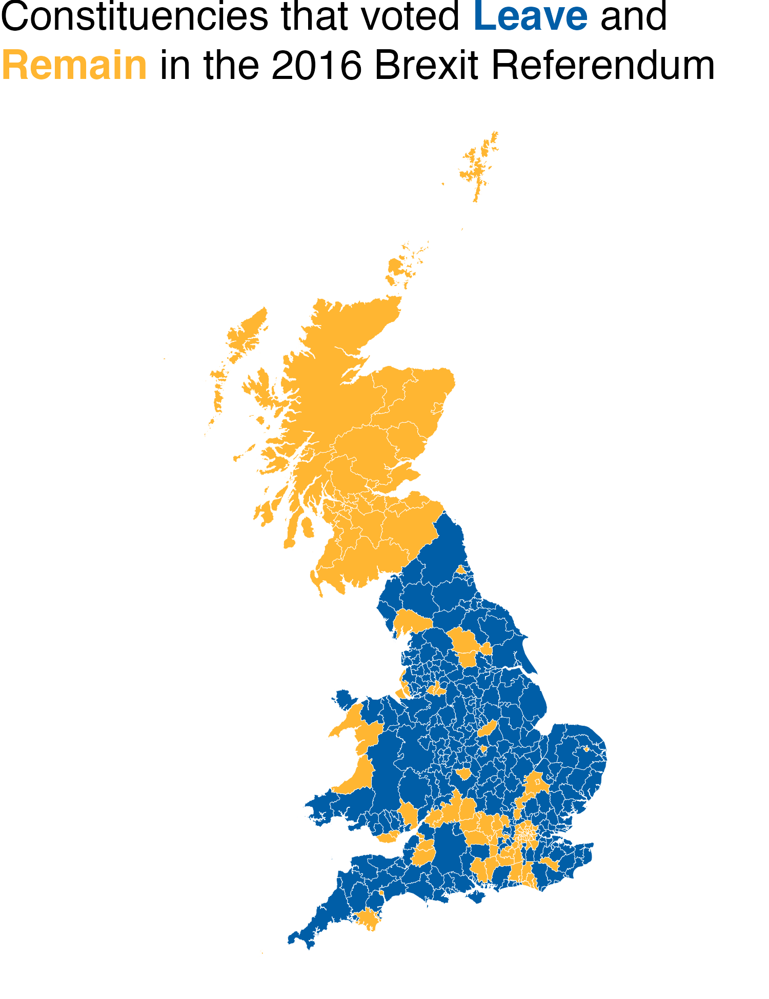
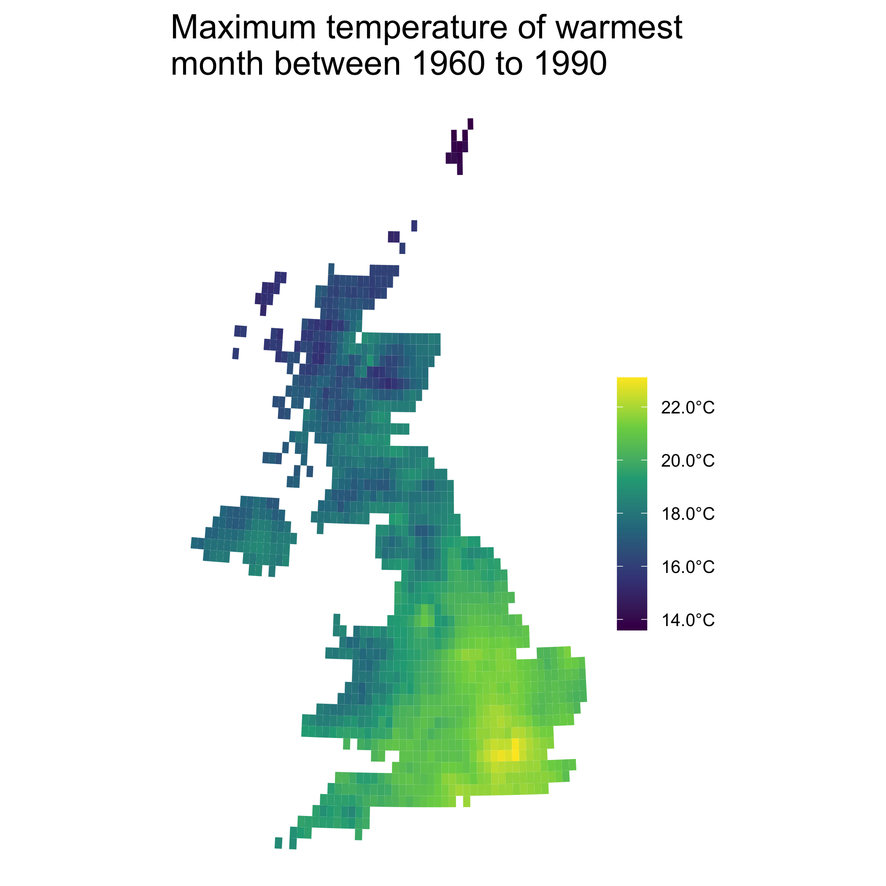
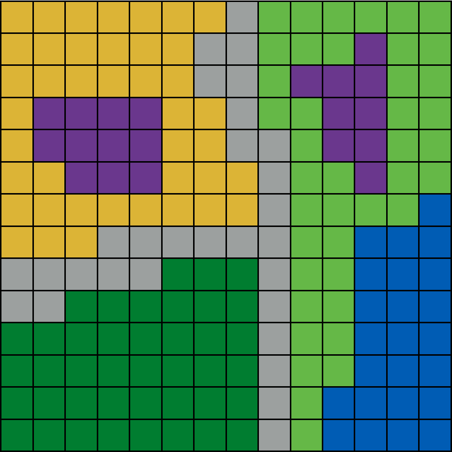
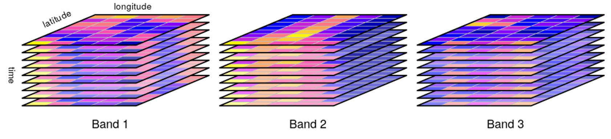
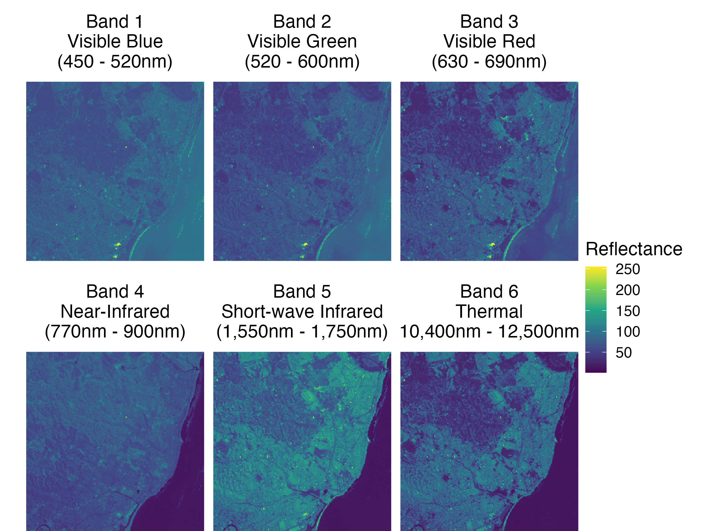

```{r child = "setup.Rmd"}
```

```{r, include=FALSE, eval=TRUE}
library("sf")
library("stars")
library("raster")
library("rnaturalearthdata")
library("mapview")
library("patchwork")
library("leaflet")
library("leaflet.extras")
library("readxl")
library("janitor")
library("emo")
library("tigris")
library("tidycensus")
library("rmapshaper")
library("patchwork")
library("tidyverse")
library("png")
library("grid")
library("here")
library("rgeoboundaries")
```

class: center, middle, dk-section-title
background-image:url("https://images.pexels.com/photos/347143/pexels-photo-347143.jpeg?auto=compress&cs=tinysrgb&dpr=2&h=750&w=1260")

# Raster GIS Overview

???


---

## Why do we have two GIS formats?

.pull-left[

Vector GIS datasets usually contain sociopolitical data.

Vector formats make sense because human locations are vectors:

- Country, county and city borders

- Roads, airline routes and bike lanes

- Physical addresses

]

--

.pull-right[

Raster GIS datasets usually contain physical data.

Raster formats are a **consequence** of how the data is collected:

- Satellite imagery

- Weather stations

- Road side air quality measurements

]

???

---

### Do I have vector or raster GIS data?

.pull-left[



]

.pull-right[

```{r, eval=FALSE, echo=FALSE, out.height="250px"}
# bands info https://developers.google.com/earth-engine/datasets/catalog/WORLDCLIM_V1_BIO#bands
# data actually comes from https://www.worldclim.org/data/v1.4/worldclim14.html
# rasters_world_clim <- getData('worldclim', var='bio', res=10)
# stars_world_clim <- rasters_world_clim %>%
#   st_as_stars()
# 
# write_stars(stars_world_clim,
#                    here("slides", "getting-map-data-into-r", "data", "stars_world_clim.tiff"))
# zip(zipfile = here("slides", "getting-map-data-into-r", "data", "stars_world_clim.zip"), files = here("slides", "getting-map-data-into-r", "data", "stars_world_clim.tiff"))

unzip(zipfile = here("slides", "getting-map-data-into-r", "data", "stars_world_clim.zip"),
      exdir = here("slides", "getting-map-data-into-r", "data"))

stars_world_clim <- read_stars(here("slides", "getting-map-data-into-r", "data", "stars_world_clim.tiff"))

unlink(here("slides", "getting-map-data-into-r", "data", "stars_world_clim.tiff"))

stars_world_clim_max_temp <- stars_world_clim %>% 
  filter(band == "bio5")

names(stars_world_clim_max_temp) <- "max_temp"

stars_world_clim_max_temp <- stars_world_clim_max_temp %>% 
  mutate(max_temp = max_temp / 10)

uk_sf <- countries50 %>%
  st_as_sf() %>% 
  filter(name == "United Kingdom") %>% 
  st_transform(27700)

stars_world_clim_max_temp <- stars_world_clim_max_temp %>% 
  st_transform(27700)

uk_mean_temp_stars <- stars_world_clim_max_temp[uk_sf]

gg_uk_max_temp <- ggplot() +
  geom_stars(data = uk_mean_temp_stars) +
  scale_fill_viridis_c(name = "",
                       labels = scales::number_format(suffix = "°C"))

gg_uk_max_temp <- gg_uk_max_temp +
  theme_void(base_size = 16) +
  labs(title = "Maximum temperature of warmest\nmonth between 1960 to 1990") +
  theme(legend.text = element_text(size = 10),
        legend.position = "right") +
  guides(fill = guide_colorbar(barheight = 10))

gg_uk_max_temp %>% 
  ggsave(here("slides", "getting-map-data-into-r", "images", "gg_uk_max_temp.png"),
         .)
```



]

???

---

## GIS raster layers

GIS raster datasets can contain multiple layers.

.pull-left[

 For **single** layer raster datasets use these packages: 

- `{raster}`

- `{terra}`

]

.pull-right[
 For raster datasets containing **multiple** layers use the `{stars}` package.
]

???

---

### Why would my data contain multiple layers?


 The Landsat program has been continuously studying observing Earth from space since 1972. 

We'll be using data from the Landsat 7 satellite multiple times in this course. 

--

All Landsat satellites collects raster data with multiple layers because:

--

- they survey the same areas **over time**.

--

- they're equipped with **multiple sensors**

--

- sensors typically collect data at **multiple wavelength bands**

???


---

### Raster data cubes

Data cubes are raster datasets with 3 dimensions.

.pull-left[

]

.pull-right[

All satellite data has at least 3 dimensions:

- longitude

- latitude

- time
]

???

---

### Hypercubes and higher dimensional raster data

Hypercubes are 4-dimensional datasets... but often raster GIS datasets have even more dimensions.

.pull-left[


]

.pull-right[
This hypercube is from Landsat 7 and contains the following dimensions:

- longitude

- latiutude

- time

- wavelength band
]

???

---

### Raster data cubes

.pull-left[
```{r, eval=TRUE, echo=FALSE}
satellite_image <- read_stars(system.file("tif/L7_ETMs.tif", package = "stars"))

band_labels <- c(
  "1" = "Band 1\nVisible Blue\n(450 - 520nm)",
  "2" = "Band 2\nVisible Green\n(520 - 600nm)",
  "3" = "Band 3\nVisible Red\n(630 - 690nm)",
  "4" = "Band 4\nNear-Infrared\n(770nm - 900nm)",
  "5" = "Band 5\nShort-wave Infrared\n(1,550nm - 1,750nm)",
  "6" = "Band 6\nThermal\n(10,400nm - 12,500nm)"
)

gg_landsat7_explainer <- ggplot() + 
  geom_stars(data = satellite_image) +
  coord_equal() +
  facet_wrap( ~ band,
              labeller = as_labeller(band_labels)) +
  theme_void(base_size = 15) +
  theme(strip.text = element_text(size = 15,
                                  margin = margin(b = 10, t = 10))) +
  scale_fill_viridis_c(name = "Reflectance") +
  scale_x_discrete(expand = c(0, 0)) +
  scale_y_discrete(expand = c(0, 0))

ggsave(here("slides", "getting-map-data-into-r", "images", "gg_landsat7_explainer.png"),
       gg_landsat7_explainer,
       width = 8,
       height = 6)
```



]

.pull-right[
This is another view of a data cube from Landsat 7.

The dimensions of this data cube are:

- longitude

- latitude

- wavelength band
]

???


