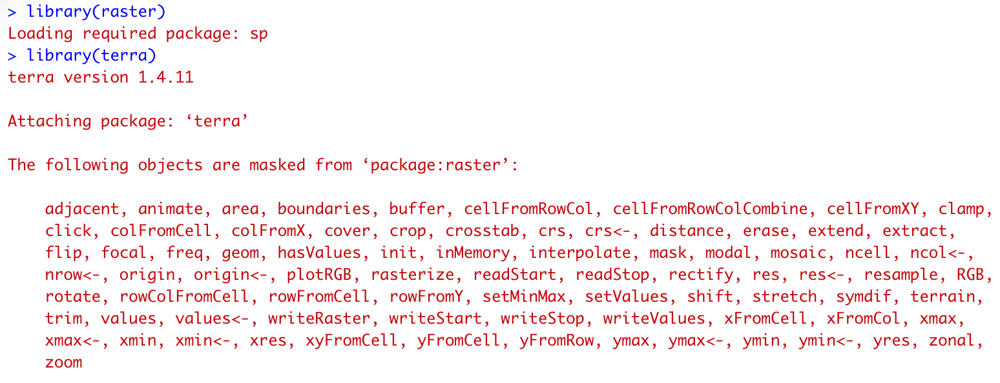

```{r child = "setup.Rmd"}
```

```{r, include=FALSE, eval=TRUE}
library("sf")
library("stars")
library("raster")
library("rnaturalearthdata")
library("mapview")
library("patchwork")
library("leaflet")
library("leaflet.extras")
library("readxl")
library("janitor")
library("emo")
library("tigris")
library("tidycensus")
library("rmapshaper")
library("patchwork")
library("tidyverse")
library("png")
library("grid")
library("here")
library("rgeoboundaries")
```

class: center, middle, dk-section-title
background-image:url("https://images.pexels.com/photos/347143/pexels-photo-347143.jpeg?auto=compress&cs=tinysrgb&dpr=2&h=750&w=1260")

# {raster} vs {terra}

???

---

# {raster} vs {terra}

Both of these packages are designed for working with single layer raster GIS datasets.

- {raster} has existed since 2010 and is extremely widely used.

- {terra} has only existed since 2020 and (as of 2022) is very novel

  - {mapview} is not yet capable of visualising {terra} objects
  
---

# {raster} vs {terra}

It's difficult to combine both packages into the same script due to function masking.




---

# {raster}, {terra} and the tidyverse

Neither of these packages are designed for a tidyverse workflow.

- We can't use `select()` and `filter()` to extract parts of these objects

- We can't modify/add parameters with `mutate()`

---

# {raster} and {terra} examples

In the visualisation sections of the course I'll provide code samples in the `data/` folder for manipulating both `{raster}` and `{terra}` objects.


