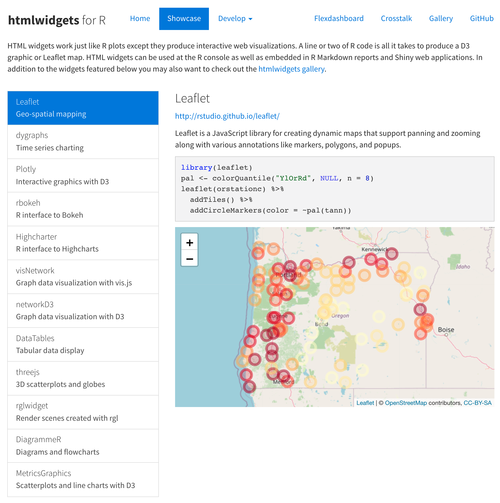

```{r child = "setup.Rmd"}
```

```{r, eval=TRUE, include=FALSE}
library("tidyverse")
library("ggspatial")
library("here")
library("ggspatial")
library("maps")
library("sf")
library("rnaturalearthdata")
library(leaflet)
colours_ggplot2_components <- as.list(set_names(ggpomological:::pomological_palette[1:5], c("aesthetics", "geoms", "scales", "guides", "themes")))
```


class: center, middle, dk-section-title
background-image:url("https://images.pexels.com/photos/5428836/pexels-photo-5428836.jpeg?auto=compress&cs=tinysrgb&dpr=2&h=750&w=1260")
background-size: cover

# What is leaflet?

---

# {leaflet} and interactive maps

The {leaflet} package allows you to create interactive maps.

These interactive maps can be created in all of these places:

- RMarkdown reports

- RMarkdown slides

- {shiny} apps

---

```{r, eval=TRUE, echo=FALSE, out.width="100%"}
countries_sf <- countries110 %>% 
  st_as_sf()

pal_continents <- colorFactor("Set2", countries_sf$continent)

popup_label <- function(name, population, continent){
  
  pretty_population <- scales::number(population,
                                      scale = 1E-6,
                                      suffix = " Million",
                                      accuracy = 1)
  
  paste0(
    str_glue("<b>{name}</b> is part of <b>{continent}</b>"),
    "<br>",
    str_glue("Estimated population: {pretty_population}")
  )
  
}

countries_sf %>% 
  leaflet() %>% 
  addPolygons(fillColor = ~pal_continents(continent),
              fillOpacity = 1,
              color = "white",
              weight = 1,
              label = ~name,
              popup = ~popup_label(name, pop_est, continent)) %>% 
  addLegend(pal = pal_continents,
            values = ~continent,
            opacity = 1)
```

---

# How is this possible?

.pull-left[
{htmlwidgets} is a tool for R developers to build R packages that allow us to make *interactive things*.

]

.pull-right[

]

---

# How is this possible?

.pull-left[
{htmlwidgets} is a tool for R developers to build R packages that allow us to make *interactive things*.

It works by wrapping JavaScript packages.

]

.pull-right[

]

---

## ... JavaScript?

1. JavaScript is the scripting language of the interactive web (often called JS).

--

2. Almost every interactive table, chart and map you'll find in a website is built with JavaScript.

--

3. Just like with R there are different JavaScript packages for doing different things

- leaflet for interactive maps

- plotly and highcharts for interactive charts

- datatables and reactable for interactive tables

---

# htmlwidgets.org

.pull-left[
{htmlwidgets} is a tool for R developers to build R packages wrap JavaScript packages.

Each {htmlwidget} package wraps a different JavaScript package.

We can then write R code to make interactive things.

]

.pull-right[

]


---

## Do I need to learn JavaScript?

Most interactive maps you'll want to make with `{leaflet}` **won't require learning any JavaScript**.

But.

... you will need to learn a little bit of HTML and potentially CSS.


