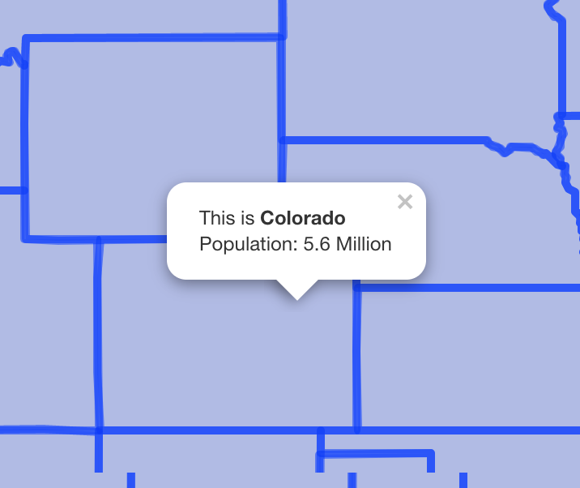

```{r child = "setup.Rmd"}
```

```{r, eval=TRUE, include=FALSE}
library("tidyverse")
library("ggspatial")
library("here")
library("ggspatial")
library("maps")
library("sf")
library("rnaturalearthdata")
library(leaflet)
library(widgetframe)
colours_ggplot2_components <- as.list(set_names(ggpomological:::pomological_palette[1:5], c("aesthetics", "geoms", "scales", "guides", "themes")))

germany_sf <- countries50 %>% 
  st_as_sf() %>% 
  filter(name == "Germany")

germany_cities <- world.cities %>% 
  filter(country.etc == "Germany") %>% 
  slice_max(pop, n = 5) %>% 
  st_as_sf(coords = c("long", "lat"),
           crs = 4326)
```


class: center, middle, dk-section-title
background-image:url("https://images.pexels.com/photos/1591061/pexels-photo-1591061.jpeg?auto=compress&cs=tinysrgb&dpr=2&h=750&w=1260")
background-size: cover

# Necessary HTML for labelling leaflet maps

---

## Why do I need HTML?

If you want multiple lines in your popups (or to format the text) the only way to do this is with HTML.

```{r, eval=TRUE, echo=FALSE, out.width="100%"}
countries_sf <- countries110 %>% 
  st_as_sf()

pal_continents <- colorFactor("Set2", countries_sf$continent)

popup_label <- function(name, population, continent){
  
  pretty_population <- scales::number(population,
                                      scale = 1E-6,
                                      suffix = " Million",
                                      accuracy = 1)
  
  paste0(
    str_glue("<b>{name}</b> is part of <b>{continent}</b>"),
    "<br>",
    str_glue("Estimated population: {pretty_population}")
  )
  
}

lf_map_demo <- countries_sf %>% 
  leaflet() %>% 
  addPolygons(fillColor = ~pal_continents(continent),
              fillOpacity = 1,
              color = "white",
              weight = 1,
              label = ~name,
              popup = ~popup_label(name, pop_est, continent)) %>% 
  addLegend(pal = pal_continents,
            values = ~continent,
            opacity = 1)

frameWidget(lf_map_demo)
```

---

# HTML basics

You know you're looking at HTML if you see a bunch of `<>` brackets.

- HTML is built (mostly) with tags that are opened with <> and closed with </> 

    - `<b></b>` for making bold text
    
    - `<p></p>` for making paragraph
    
    - `<a href='https://google.com'>/<a>` for making hyperlinks
    
---

# HTML basics

You know you're looking at HTML if you see a bunch of `<>` brackets.

- HTML is built (mostly) with tags that are opened with <> and closed with </> 

- There are some special tags that don't need to be closed, one is very useful to us:

    - `<br>` creates a linebreak.

---

# Two types of label in {leaflet}

There are two different types of label:

.pull-left[
```{r}
addPolygons(label = ~name)
```

This adds text that appears when the cursor hovers over a polygon.

This text **cannot** be formatted with HTML.

]

.pull-left[
```{r}
addPolygons(popup = ~name)
```

This adds a popup that only appears when the reader clicks a polygon.

This text **can** be formatted with HTML.

]

---

class: my-turn

# My turn

.pull-left[
I'm going to replicate the labels in this map.
]

.pull-right[
```{r, eval=TRUE, echo=FALSE}
lf_my_turn <- countries_sf %>% 
  leaflet() %>% 
  addPolygons(color = "white",
              fillColor = "forestgreen",
              weight = 1,
              label = ~name,
              popup = ~popup_label(name, pop_est, continent))

frameWidget(lf_my_turn)
```

]

---

class: inverse

# Your turn

.pull-left[
Use the `your-turn.R` script in `03_03` to add this popup to each state.

- Format the state name in bold

- Use a `<br>` to add a line break

- Use `scales::number()` to format the population
]


.pull-right[

]


