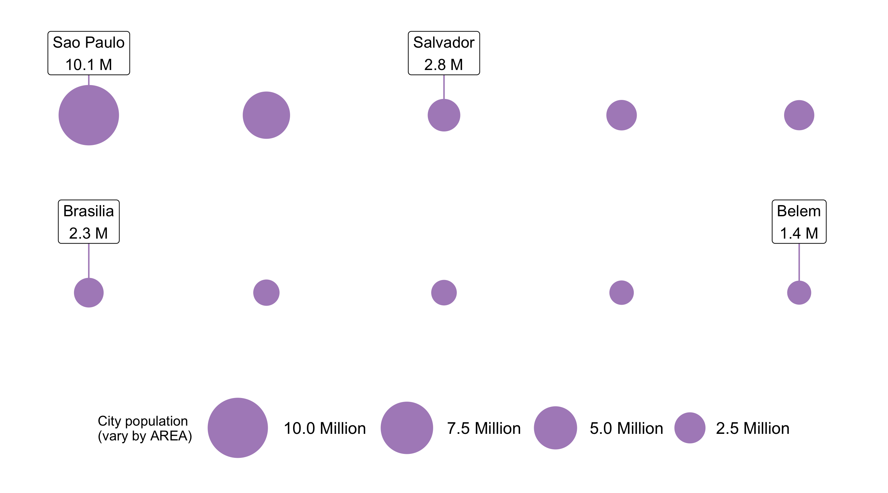

```{r child = "setup.Rmd"}
```

```{r, include=FALSE, eval=TRUE}
library(tidyverse)
library(sf)
library(rnaturalearthdata)
library(maps)
library(here)
library(janitor)
library(readxl)
library(leaflet)
library(scales)
library(rmapshaper)
library(tigris)
library(widgetframe)
library(leaflegend)
options(htmltools.preserve.raw = FALSE)

# uk_addresses <- read_excel(here("slides", "static-maps-with-ggplot2", "data", "street-addresses.xlsx"),
#                            sheet = "UK Addresses") %>% 
#   clean_names()
# 
# uk_addresses <- uk_addresses %>% 
#   mutate(across(business_name:country, ~str_replace_na(., ""))) %>% 
#   mutate(full_street_address = paste(business_name, street, sep = ", "))
# 
# uk_addresses <- uk_addresses %>% 
#   geocode(street = full_street_address,
#           city = city,
#           postalcode = post_code,
#           country = country,
#           method = "iq")
# 
# uk_addresses_sf <- uk_addresses %>% 
#   st_as_sf(coords = c("long", "lat"), crs = 4326)
# 
# uk_addresses_sf %>% 
#   saveRDS(here("slides", "static-maps-with-ggplot2", "data", "street-addresses.rds"))
brazil_cities <- world.cities %>% 
  filter(country.etc == "Brazil",
         pop > 1e6) %>% 
  mutate(capital = as.logical(capital)) %>% 
  arrange(desc(pop))

brazil_cities_sf <- brazil_cities %>% 
  st_as_sf(coords = c("long", "lat"), crs = 4326)

brazil_sf <- countries50 %>% 
  st_as_sf() %>% 
  filter(name == "Brazil")
```

class: center, middle, dk-section-title
background-image:url("https://images.pexels.com/photos/2853937/pexels-photo-2853937.jpeg?auto=compress&cs=tinysrgb&dpr=2&h=750&w=1260")
background-size: cover

# Compare locations (or events) with geobubble charts with {leaflet}

---

# Geobubble charts

```{r, echo=FALSE, eval=TRUE, out.height='100%'}
bubble_sqrt <- function(population){
  
  sqrt(population) * 5E-3
  
}

city_label <- function(city, population){
  
  formatted_pop <- scales::number(population, 
                                  scale = 1E-6,
                                  suffix = " Million",
                                  accuracy = 0.1)
  
  paste(
    "<b>", city, "</b>",
    "<br>",
    "Estimated population:", formatted_pop
  )
}


brazil_cities_sf <- brazil_cities_sf %>% 
  arrange(desc(pop))

lf_intro_map <- leaflet() %>% 
  addPolygons(data = brazil_sf,
              weight = 1,
              fillColor = "darkolivegreen",
              fillOpacity = 1,
              opacity = 0) %>% 
  addCircleMarkers(data = brazil_cities_sf,
                   label = ~name,
                   popup = ~city_label(name, pop),
                   radius = ~ bubble_sqrt(pop),
                   stroke = TRUE,
                   weight = 2,
                   color = "black",
                   fillOpacity = 1,
                   fillColor = "lightgrey")

frameWidget(lf_intro_map)
```

---

## Bubbles don't scale well by radius

```{r, eval=FALSE, echo=FALSE}
brazil_top_10 <- world.cities %>% 
  as_tibble() %>% 
  filter(country.etc == "Brazil") %>%
  slice_max(pop, n = 10) %>% 
  st_as_sf(coords = c("long", "lat"), crs = 4326) %>% 
  mutate(capital = as.logical(capital)) %>% 
  arrange(desc(pop)) %>% 
  mutate(city = name)


label_city_shape <- function(city, pop = NA){
  
  paste0(city, "\n", number(pop, suffix = " M", scale = 1e-6, accuracy = 0.1))
  
}

oblong_horiz_city_positions <- brazil_top_10 %>%
  mutate(x = c(1, 3, 5, 7, 9, 1, 3, 5, 7, 9),
         y = c(5, 5, 5, 5, 5, 3, 3, 3, 3, 3))

labelled_cities <- oblong_horiz_city_positions %>% 
  st_drop_geometry() %>% 
  filter(city %in% c("Sao Paulo", "Salvador", "Brasilia", "Belem"))
  

gg_bubble_size_by_radius <- oblong_horiz_city_positions %>%
  ggplot(aes(x, y, size = pop)) +
  coord_fixed(xlim = c(0, 10),
              ylim = c(2, 6),
              expand = FALSE) +
  geom_point(color = "#af8dc3")  +
  scale_radius(range = c(1, 30),
               name = "City population\n(vary by RADIUS)",
               labels = number_format(suffix = " Million",
                                      scale = 1e-6)) +
  geom_label_repel(data = labelled_cities,
                   aes(x, y, label = label_city_shape(city, pop)),
                   nudge_y = 0.8,
                   nudge_x = c(0.9, rep(0, 3)),
                   size = 4,
                   segment.color = '#af8dc3',
                   show.legend = F) +
  guides(size = guide_legend(reverse=TRUE)) +
  theme_void(base_size = 10) +
  theme(legend.position = "bottom", legend.direction = "horizontal", 
        plot.title = element_text(size = 15,
                                  hjust = 0.5),
        legend.text=element_text(size=12))

gg_bubble_size_by_radius %>% 
  ggsave(here("slides", "static-maps-with-ggplot2", "images", "gg_bubble_size_by_radius.png"),
         .,
         width = 9,
         height = 5)
```

<center><center>


---

## Bubbles should be scaled by area

```{r, eval=FALSE, echo=FALSE}
gg_bubble_size_by_area <- oblong_horiz_city_positions %>%
  ggplot(aes(x, y, size = pop)) +
  coord_fixed(xlim = c(0, 10),
              ylim = c(2, 6),
              expand = FALSE) +
  geom_point(color = "#af8dc3")  +
  scale_size_area(max_size = 20,
                  name = "City population\n(vary by AREA)",
                  position = "bottom",
                  labels = number_format(suffix = " Million",
                                         scale = 1e-6)) +
  guides(size = guide_legend(reverse = TRUE)) +
  geom_label_repel(data = labelled_cities,
                   aes(x, y, label = label_city_shape(city, pop)),
                   nudge_y = 0.8,
                   nudge_x = 0,
                   size = 4,
                   segment.color = '#af8dc3',
                   show.legend = F) +
  theme_void(base_size = 10) +
  theme(legend.position = "bottom", legend.direction = "horizontal", 
        plot.title = element_text(size = 15,
                                  hjust = 0.5),
        legend.text=element_text(size=12))

gg_bubble_size_by_area %>% 
  ggsave(here("slides", "static-maps-with-ggplot2", "images", "gg_bubble_size_by_area.png"),
         .,
         width = 9,
         height = 5)
```


<center><center>

---

# We need to do maths ourselves

```{r}
scale_bubble <- function(population) {
  sqrt(x) * scale_factor
}

... %>% 
  addCircleMarkers(radius = ~scale_bubble(pop))
```


---

class: my-turn

## My turn

.pull-left[
I'm going to recreate this geobubble chart.
]

.pull-right[
```{r, eval=TRUE, echo=FALSE}
frameWidget(lf_intro_map)
```

]

---

## What about legends?

.pull-left[

The `{leaflet}` package doesn't contain a size scale legend.

```{r, eval=TRUE, echo=FALSE}
pal_population <- colorBin("viridis", brazil_cities_sf$pop)

lf_color_legend <- leaflet() %>% 
  addPolygons(data = brazil_sf,
              weight = 1,
              fillColor = "darkolivegreen",
              fillOpacity = 1,
              opacity = 0) %>% 
  addCircleMarkers(data = brazil_cities_sf,
                   label = ~name,
                   popup = ~city_label(name, pop),
                   radius = ~ bubble_sqrt(pop),
                   stroke = TRUE,
                   weight = 2,
                   color = "black",
                   fillOpacity = 1,
                   fillColor = ~pal_population(pop)) %>% 
  addLegend(pal = pal_population,
            values = ~pop,
            data = brazil_cities_sf,
            labFormat = labelFormat(transform = function(x) x * 1E-6, suffix = "Million"),
            opacity = 1)

frameWidget(lf_color_legend,
            height = "350px")
```

]

.pull-right[

The {leaflegend} package adds size scale legend

```{r, eval=TRUE, echo=FALSE}
bubble_base_size <- 10

generated_circles <- makeSizeIcons(value = sort(brazil_cities_sf$pop),
                                   'circle',
                                   baseSize = bubble_base_size,
                                   opacity = 0.8,
                                   color = 'black',
                                   fillColor = "lightgrey")

lf_size_legend <- leaflet() %>% 
  addPolygons(data = brazil_sf,
              weight = 1,
              fillColor = "darkolivegreen",
              fillOpacity = 1,
              opacity = 0) %>% 
  addMarkers(data = arrange(brazil_cities_sf, pop),
             label = ~name,
             icon = generated_circles) %>% 
  addLegendSize(shape = 'circle',
                color = 'black',
                baseSize = bubble_base_size,
                values = brazil_cities_sf$pop,
                orientation = 'vertical',
                numberFormat = function(x) {scales::number(x, scale = 1E-6, suffix = " M") },
                position = 'bottomright',
                title = "City population"
  )

lf_size_legend %>% 
  frameWidget(height = "350px")
```

]

---

# Issues with {leaflegend}

.pull-left[

- The order of points cannot be changed for smaller cities to show on top.

- The bubble sizes change anyway when the user zooms
 
]

.pull-right[
```{r, eval=TRUE, echo=FALSE}
lf_size_legend %>% 
  frameWidget(height = "350px")
```

]

---

class: inverse

## Your turn

.pull-left[
Use the `your-turn.R` script in 03_05 to create this geobubble chart of the busiest airports in the US.

- Ensure small circles are not overlapped by bigger circles

- Give the circles both a fill color and border color

- Add a label to each airport
]

.pull-right[
```{r, include=FALSE, eval=TRUE}
us_airport_passengers <- read_csv(here("slides", "static-maps-with-ggplot2", "data", "us-airport-passenger-numbers_2019.csv"))

us_airport_passengers_2019 <- us_airport_passengers %>% 
  mutate(airport = str_remove_all(airport, "[\\[].*[\\]]")) %>% 
  filter(year == 2019) %>% 
  slice_max(total_passengers, n = 10) %>% 
  st_as_sf(coords = c("long", "lat"))

us_contiguous_sf <- states() %>% 
  clean_names() %>% 
  mutate(statefp = as.numeric(statefp)) %>% 
  filter(statefp < 60,
         !statefp %in% c(2, 15)) %>% 
  ms_simplify()
```


```{r eval=TRUE, echo=FALSE, message=FALSE, warning=FALSE}
us_airport_passengers_2019 <- us_airport_passengers_2019 %>% 
  arrange(desc(total_passengers))

popup_airport <- function(airport, passengers){
  
  format_passengers <- scales::number(passengers, scale = 1E-6, suffix = " Million", accuracy = 1)
  
  paste(
    airport, "flew", format_passengers, "passengers in 2019"
  )
  
}

scale_bubble <- function(passengers){
  
  sqrt(passengers) * 6E-3
  
}

lf_your_turn <- leaflet() %>% 
  addPolygons(data = us_contiguous_sf,
              fillColor = "darkolivegreen",
              fillOpacity = 1,
              color = "white",
              weight = 1) %>% 
  addCircleMarkers(data = us_airport_passengers_2019,
                   radius = ~ scale_bubble(total_passengers),
                   fillColor = "grey",
                   fillOpacity = 0.8,
                   label = ~airport,
                   color = "black",
                   popup = ~popup_airport(airport, total_passengers),
                   weight = 1)


lf_your_turn %>% 
  frameWidget()
```
]


