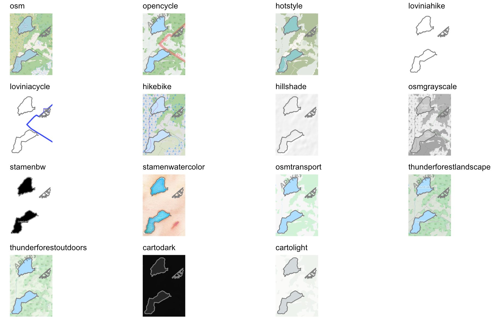

```{r child = "setup.Rmd"}
```

```{r, include=FALSE, eval=TRUE}
library("raster")
library("tidyverse")
library("sf")
library("lubridate")
library("patchwork")
library("fivethirtyeight")
library("rnaturalearthdata")
library("maps")
library("here")
library("ggspatial")
library("stars")
library("ggrepel")
```


class: center, middle, dk-section-title
background-image:url("images/pexels-photo-7431661.jpeg")
background-size: cover

# Starting a map in {ggplot2}

---

> How much context does your map need?

<center>
```{r, echo=FALSE, eval=TRUE, dpi=300, out.width='100%', fig.asp=4/8}
germany_sf <- countries50 %>% 
  st_as_sf() %>% 
  filter(name == "Germany")

germany_cities_sf <- world.cities %>% 
  filter(country.etc == "Germany") %>% 
  slice_max(pop, n = 10) %>% 
  st_as_sf(coords = c("long", "lat"),
           crs = 4326)

germany_cities_tib <- germany_cities_sf %>%
  st_coordinates() %>% 
  as_tibble() %>% 
  bind_cols(st_drop_geometry(germany_cities_sf)) %>% 
  arrange(Y)


gg_germany_without_tiles <- ggplot() +
  # annotation_map_tile(zoomin = 0) +
  geom_sf(data = germany_sf,
          fill = NA) +
  geom_sf(data = germany_cities_sf) +
  ggthemes::theme_map()

gg_germany_with_labels <- ggplot() +
  geom_sf(data = germany_sf,
          fill = NA) +
  geom_sf(data = germany_cities_sf) +
  geom_label_repel(data = germany_cities_tib,
                   aes(x = X,
                       y = Y,
                       label = name),
                   size = 3) +
  ggthemes::theme_map(base_size = 4)

gg_germany_with_tiles <- ggplot() +
  annotation_map_tile(zoomin = 0) +
  geom_sf(data = germany_sf,
          fill = NA) +
  geom_sf(data = germany_cities_sf,
          size = 1) +
  ggthemes::theme_map()

gg_germany_without_tiles + gg_germany_with_labels + gg_germany_with_tiles
```
</center>

---

# Map tiles with {ggspatial}

The {ggspatial} package provides access to 15 different map types:

```{r,eval=TRUE}
rosm::osm.types()
```

---

```{r, include=FALSE}
load_longlake_data()

gg_osm_type <- function(osm_type){
  
  ggplot() +
    annotation_map_tile(type = osm_type) +
    geom_sf(data = longlake_waterdf, fill = NA, col = "grey50") +
    labs(title = osm_type) +
    ggthemes::theme_map()
  
}

library("cowplot")

gg_all_charts <- purrr::map(rosm::osm.types(), ~gg_osm_type(.x))

plot_grid(plotlist = gg_all_charts,
          nrow = 4)
```

<center>

</center>
---

# Using annotation_map_tile()

- `annotation_map_tile(zoomin = -2)` is the default and will likely download too few tiles for a good chart

