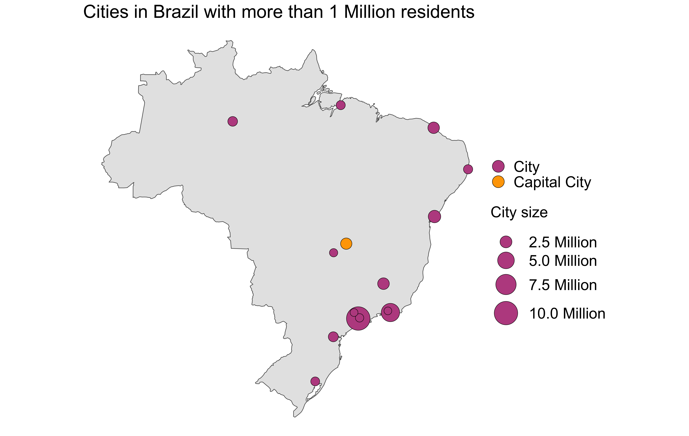
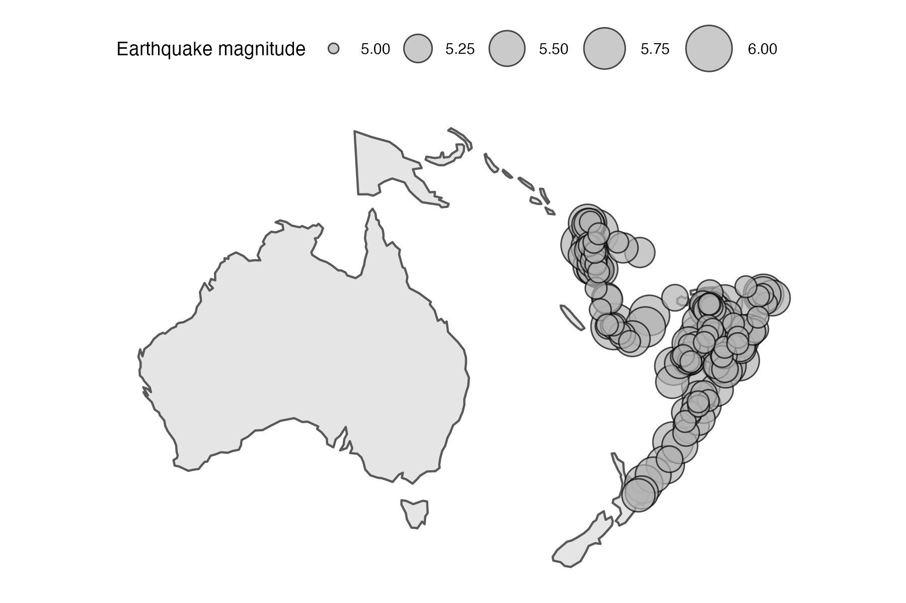
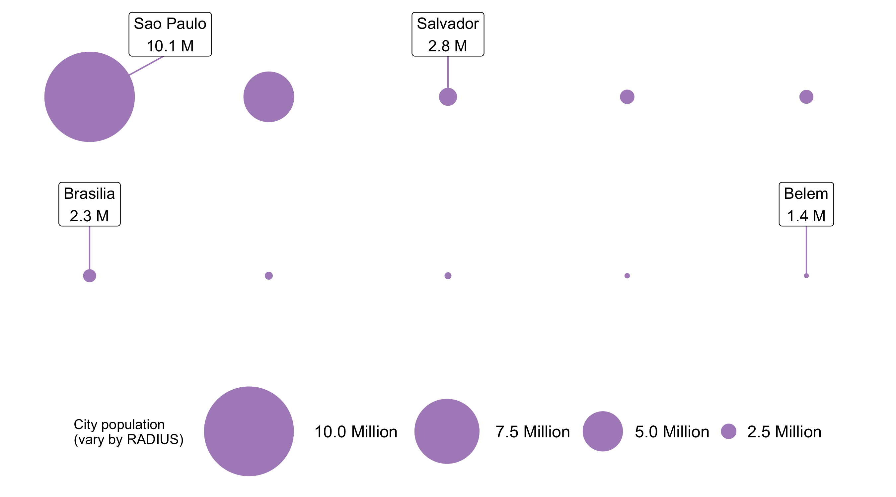
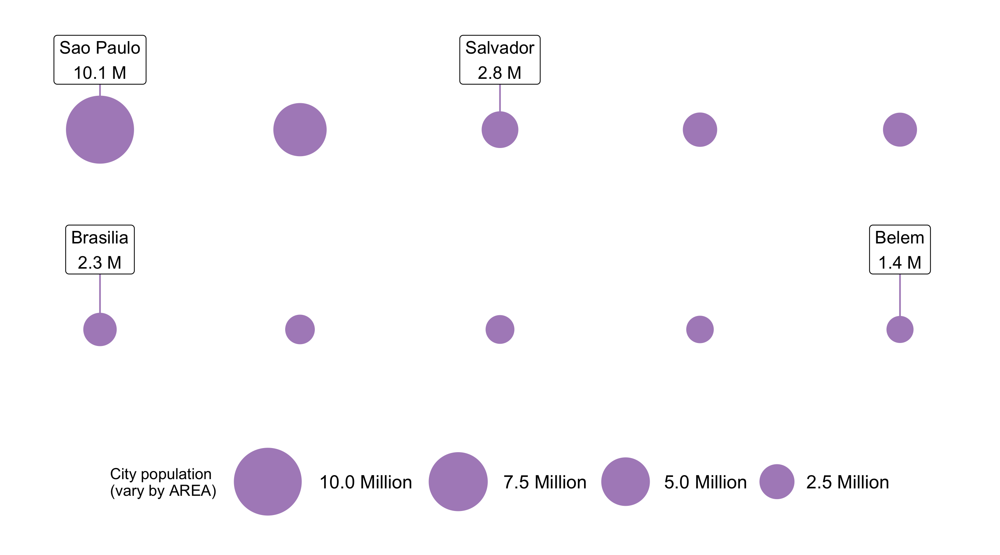
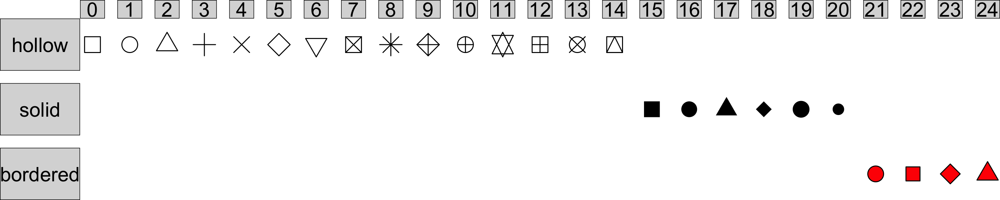
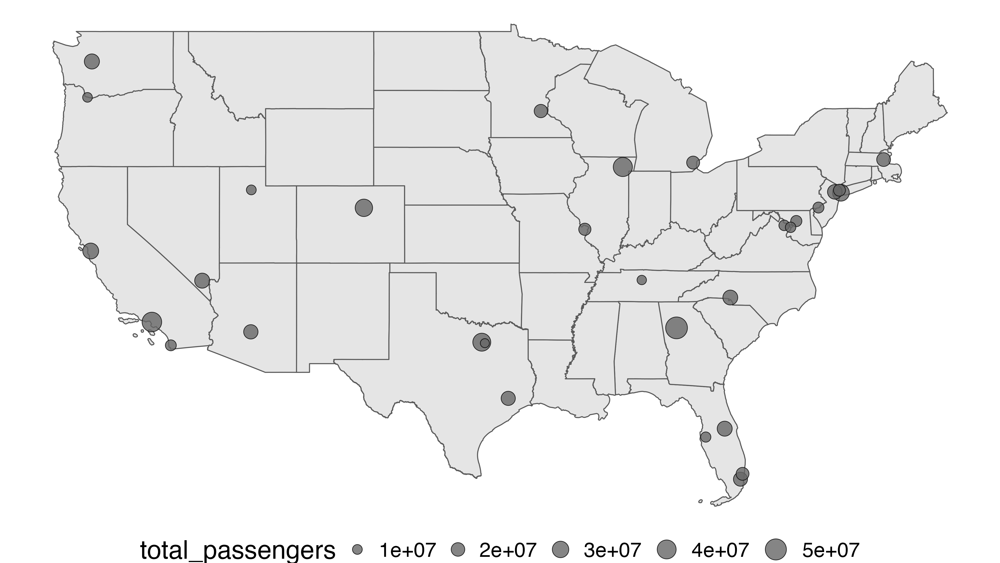

```{r child = "setup.Rmd"}
```

```{r, include=FALSE, eval=TRUE}
library("tidyverse")
library("sf")
library("rnaturalearthdata")
library("maps")
library("here")
library("ggspatial")
library("janitor")
library("readxl")
library("tidygeocoder")
library("ggspatial")
library("leaflet")
library("ggrepel")
library("scales")
library("fontawesome")
library("rmapshaper")
library("tigris")
options(htmltools.preserve.raw = FALSE)

# uk_addresses <- read_excel(here("slides", "static-maps-with-ggplot2", "data", "street-addresses.xlsx"),
#                            sheet = "UK Addresses") %>% 
#   clean_names()
# 
# uk_addresses <- uk_addresses %>% 
#   mutate(across(business_name:country, ~str_replace_na(., ""))) %>% 
#   mutate(full_street_address = paste(business_name, street, sep = ", "))
# 
# uk_addresses <- uk_addresses %>% 
#   geocode(street = full_street_address,
#           city = city,
#           postalcode = post_code,
#           country = country,
#           method = "iq")
# 
# uk_addresses_sf <- uk_addresses %>% 
#   st_as_sf(coords = c("long", "lat"), crs = 4326)
# 
# uk_addresses_sf %>% 
#   saveRDS(here("slides", "static-maps-with-ggplot2", "data", "street-addresses.rds"))
colours_ggplot2_components <- as.list(set_names(ggpomological:::pomological_palette[1:5], c("aesthetics", "geoms", "scales", "guides", "themes")))

uk_addresses_sf <- readRDS(here("slides", "static-maps-with-ggplot2", "data", "street-addresses.rds"))

uk_sf <- countries50 %>% 
  st_as_sf() %>% 
  filter(name == "United Kingdom")
```

class: center, middle, dk-section-title
background-image:url("https://images.pexels.com/photos/2853937/pexels-photo-2853937.jpeg?auto=compress&cs=tinysrgb&dpr=2&h=750&w=1260")
background-size: cover

# Compare locations (or events) with geobubble charts

---

# Geobubble charts

```{r, echo=FALSE, eval=FALSE}
brazil_cities <- world.cities %>% 
  filter(country.etc == "Brazil",
         pop > 1e6) %>% 
  mutate(capital = as.logical(capital)) %>% 
  arrange(desc(pop))

brazil_cities_sf <- brazil_cities %>% 
  st_as_sf(coords = c("long", "lat"), crs = 4326)

brazil_sf <- countries50 %>% 
  st_as_sf() %>% 
  filter(name == "Brazil")

gg_brazil_cities <- ggplot() +
  geom_sf(data = brazil_sf) +
  geom_sf(data = brazil_cities_sf,
          aes(fill = capital,
              size = pop),
          shape = 21) +
  # geom_label_repel(
  #   data = biggest_smallest_city,
  #   aes(x = long,
  #       y = lat,
  #       label = name),
  #   point.size = scales::rescale(biggest_smallest_city$pop, c(1, 20)),
  #   size = 6
  # ) +
  scale_fill_manual(
    labels = c("TRUE" = "Capital City",
               "FALSE" = "City"),
    values = c("TRUE" = "#ffa600",
               "FALSE" = "#bc5090"),
    name = ""
  ) +
  scale_size_area(
    max_size = 20,
    labels = scales::number_format(suffix = " Million",
                                   scale = 1e-6),
    name = "City size"
  ) +
  theme_void(base_size = 18) +
  theme(legend.text = element_text(size = 28),
        legend.title = element_text(size = 28),
        legend.spacing.y = unit(1, "cm"), title = element_text(size = 28)) +
  guides(size = guide_legend(override.aes = list(fill = "#bc5090")),
         fill = guide_legend(override.aes = list(size = 10))) +
  labs(title = "Cities in Brazil with more than 1 Million residents")

gg_brazil_cities %>%
  ggsave(here("slides", "static-maps-with-ggplot2", "images", "gg_brazil_cities.png"),
         .)
```

<center></center>

---

# Geobubble charts

```{r, eval=TRUE, echo=FALSE}
crs_quakes <- st_crs('PROJCS["ProjWiz_Custom_Equidistant_Conic",
 GEOGCS["GCS_WGS_1984",
  DATUM["D_WGS_1984",
   SPHEROID["WGS_1984",6378137.0,298.257223563]],
  PRIMEM["Greenwich",0.0],
  UNIT["Degree",0.0174532925199433]],
 PROJECTION["Equidistant_Conic"],
 PARAMETER["False_Easting",0.0],
 PARAMETER["False_Northing",0.0],
 PARAMETER["Central_Meridian",149.0625],
 PARAMETER["Standard_Parallel_1",-44.8478646],
 PARAMETER["Standard_Parallel_2",-1.1330309],
 PARAMETER["Latitude_Of_Origin",-22.9904477],
 UNIT["Meter",1.0]]')

oceania_sf <- countries110 %>% 
  st_as_sf() %>% 
  filter(continent == "Oceania") %>% 
  st_transform(crs = crs_quakes)

quakes_sf <- quakes %>% 
  st_as_sf(coords = c("long", "lat"), crs = 4326) %>% 
  st_transform(crs = crs_quakes) %>% 
  filter(mag > 5) %>% 
  arrange(desc(mag))

bbox_quakes <- as.list(st_bbox(quakes_sf))

# ==== ggplot2 ====

gg_quakes <- ggplot() +
  geom_sf(data = oceania_sf) +
  geom_sf(data = quakes_sf,
          aes(size = mag),
          shape = 21,
          alpha = 0.7,
          fill = "grey70") +
  scale_size(limits = c(5, 6),
             range = c(2, 10),
             name = "Earthquake magnitude") +
  ggthemes::theme_map() +
  theme(legend.position = "top")

ggsave(here("slides", "static-maps-with-ggplot2", "images", "gg_quakes.png"),
       gg_quakes,
       width = 6,
       height = 4)
```

<center></center>

---

# Geobubble <span style='color:`r colours_ggplot2_components$scales`'>scales</span> `r fa(name = "balance-scale", fill = colours_ggplot2_components$scales)`

In a geobubble chart we use the <span style='color:`r colours_ggplot2_components$aesthetics`'>size aesthetic</span> of `geom_point()` to vary the size of our bubbles.

--

There are <span style='color:`r colours_ggplot2_components$scales`'>**two extremely different scales**</span> that {ggplot2} can use to decide how to vary the sizes of the points:

--

- scale_size()<sup>1</sup>

- scale_radius()

.footnote[
[1] The default chosen by {ggplot2}
]

---

## Don't use scale_radius()

```{r, eval=FALSE, echo=FALSE}
brazil_top_10 <- world.cities %>% 
  as_tibble() %>% 
  filter(country.etc == "Brazil") %>%
  slice_max(pop, n = 10) %>% 
  st_as_sf(coords = c("long", "lat"), crs = 4326) %>% 
  mutate(capital = as.logical(capital)) %>% 
  arrange(desc(pop)) %>% 
  mutate(city = name)


label_city_shape <- function(city, pop = NA){
  
  paste0(city, "\n", number(pop, suffix = " M", scale = 1e-6, accuracy = 0.1))
  
}

oblong_horiz_city_positions <- brazil_top_10 %>%
  mutate(x = c(1, 3, 5, 7, 9, 1, 3, 5, 7, 9),
         y = c(5, 5, 5, 5, 5, 3, 3, 3, 3, 3))

labelled_cities <- oblong_horiz_city_positions %>% 
  st_drop_geometry() %>% 
  filter(city %in% c("Sao Paulo", "Salvador", "Brasilia", "Belem"))
  

gg_bubble_size_by_radius <- oblong_horiz_city_positions %>%
  ggplot(aes(x, y, size = pop)) +
  coord_fixed(xlim = c(0, 10),
              ylim = c(2, 6),
              expand = FALSE) +
  geom_point(color = "#af8dc3")  +
  scale_radius(range = c(1, 30),
               name = "City population\n(vary by RADIUS)",
               labels = number_format(suffix = " Million",
                                      scale = 1e-6)) +
  geom_label_repel(data = labelled_cities,
                   aes(x, y, label = label_city_shape(city, pop)),
                   nudge_y = 0.8,
                   nudge_x = c(0.9, rep(0, 3)),
                   size = 4,
                   segment.color = '#af8dc3',
                   show.legend = F) +
  guides(size = guide_legend(reverse=TRUE)) +
  theme_void(base_size = 10) +
  theme(legend.position = "bottom", legend.direction = "horizontal", 
        plot.title = element_text(size = 15,
                                  hjust = 0.5),
        legend.text=element_text(size=12))

gg_bubble_size_by_radius %>% 
  ggsave(here("slides", "static-maps-with-ggplot2", "images", "gg_bubble_size_by_radius.png"),
         .,
         width = 9,
         height = 5)
```

<center><center>


---

## Use scale_size_area()

```{r, eval=FALSE, echo=FALSE}
gg_bubble_size_by_area <- oblong_horiz_city_positions %>%
  ggplot(aes(x, y, size = pop)) +
  coord_fixed(xlim = c(0, 10),
              ylim = c(2, 6),
              expand = FALSE) +
  geom_point(color = "#af8dc3")  +
  scale_size_area(max_size = 20,
                  name = "City population\n(vary by AREA)",
                  position = "bottom",
                  labels = number_format(suffix = " Million",
                                         scale = 1e-6)) +
  guides(size = guide_legend(reverse = TRUE)) +
  geom_label_repel(data = labelled_cities,
                   aes(x, y, label = label_city_shape(city, pop)),
                   nudge_y = 0.8,
                   nudge_x = 0,
                   size = 4,
                   segment.color = '#af8dc3',
                   show.legend = F) +
  theme_void(base_size = 10) +
  theme(legend.position = "bottom", legend.direction = "horizontal", 
        plot.title = element_text(size = 15,
                                  hjust = 0.5),
        legend.text=element_text(size=12))

gg_bubble_size_by_area %>% 
  ggsave(here("slides", "static-maps-with-ggplot2", "images", "gg_bubble_size_by_area.png"),
         .,
         width = 9,
         height = 5)
```


<center><center>

---

class: my-turn

## My turn

.pull-left[
I'm going to recreate this geobubble chart.
]

.pull-right[
<center></center>
]

---

# `r fa(name = "shapes", fill = colours_ggplot2_components$geoms)` <span style='color:`r colours_ggplot2_components$geoms`'>geom_point(pch = ?)</span>

geom_point() is unique in that it has a `pch`<sup>1</sup> argument - this controls which shape is drawn on your chart.

<br>

```{r, eval=FALSE, echo=FALSE}
df_shapes <- tibble(shape = 0:24) %>% 
  mutate(type = c(rep("hollow", 15), rep("solid", 6), rep("bordered", 4)),
         type = as_factor(type))

gg_shape_types <- ggplot(df_shapes, aes(0, 0, shape = shape)) +
  geom_point(aes(shape = shape), size = 5, fill = 'red') +
  scale_shape_identity() +
  facet_grid(type ~ shape,
             switch = "y") +
  theme_void(base_size = 18) +
  theme(strip.text.y.left = element_text(angle = 0),
        strip.background = element_rect(fill = "grey85"))

ggsave(here("slides", "static-maps-with-ggplot2", "images", "gg_shape_types.png"),
       gg_shape_types,
       width = 10,
       height = 2)
```



.footnote[
[1] `pch` stands for "plotting character"
]

---

class: inverse

## Your turn

```{r, include=FALSE}
us_airport_passengers <- read_csv(here("slides", "static-maps-with-ggplot2", "data", "us-airport-passenger-numbers_2019.csv"))

us_airport_passengers_2019 <- us_airport_passengers %>% 
  filter(year == 2019) %>% 
  st_as_sf(coords = c("long", "lat"),
           crs = 4326)

us_contiguous_sf <- states() %>% 
  clean_names() %>% 
  mutate(statefp = as.numeric(statefp)) %>% 
  filter(statefp < 60,
         !statefp %in% c(2, 15)) %>% 
  ms_simplify()

us_airport_passengers_2019 <- us_airport_passengers_2019 %>% 
  arrange(desc(total_passengers))

gg_us_airports <- ggplot() +
  geom_sf(data = us_contiguous_sf) +
  geom_sf(data = us_airport_passengers_2019,
          aes(size = total_passengers),
          pch = 21,
          fill = "grey40",
          alpha = 0.8) +
  scale_size_area(max_size = 10) +
  theme_void(base_size = 26) +
  theme(legend.position = "bottom")

ggsave(here("slides", "static-maps-with-ggplot2", "images", "gg_us_airports.png"),
       gg_us_airports)
```

.pull-left[
Use the `your-turn.R` script in 02_04 to create this geobubble chart of the most popular airports in the US.

- Ensure small circles are not overlapped by bigger circles

- Give the circles both a fill color and border color
]

.pull-right[

]


