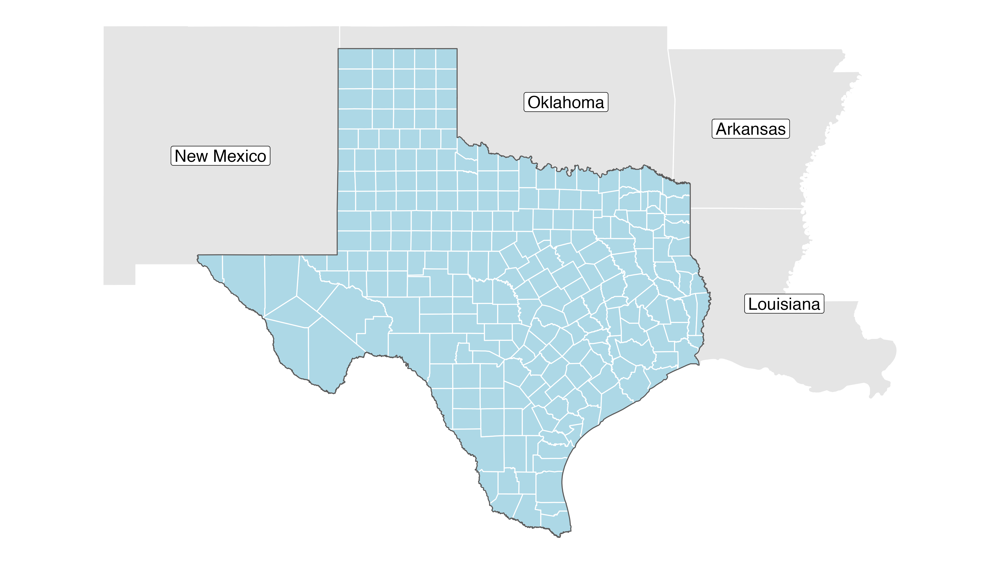
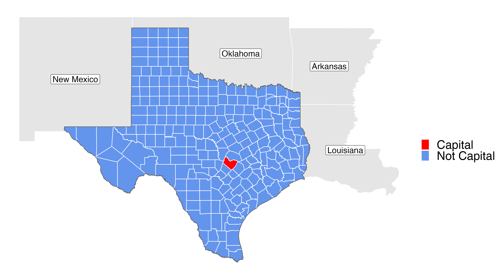

```{r child = "setup.Rmd"}
```

```{r, include=FALSE, eval=TRUE}
library("tidyverse")
library("sf")
library("rnaturalearthdata")
library("maps")
library("here")
library("ggspatial")
library("janitor")
library("readxl")
library("tidygeocoder")
library("ggspatial")
library("leaflet")
library("ggrepel")
library("scales")
library("fontawesome")
library("rmapshaper")
library("tigris")
options(htmltools.preserve.raw = FALSE)

# uk_addresses <- read_excel(here("slides", "static-maps-with-ggplot2", "data", "street-addresses.xlsx"),
#                            sheet = "UK Addresses") %>% 
#   clean_names()
# 
# uk_addresses <- uk_addresses %>% 
#   mutate(across(business_name:country, ~str_replace_na(., ""))) %>% 
#   mutate(full_street_address = paste(business_name, street, sep = ", "))
# 
# uk_addresses <- uk_addresses %>% 
#   geocode(street = full_street_address,
#           city = city,
#           postalcode = post_code,
#           country = country,
#           method = "iq")
# 
# uk_addresses_sf <- uk_addresses %>% 
#   st_as_sf(coords = c("long", "lat"), crs = 4326)
# 
# uk_addresses_sf %>% 
#   saveRDS(here("slides", "static-maps-with-ggplot2", "data", "street-addresses.rds"))
colours_ggplot2_components <- as.list(set_names(ggpomological:::pomological_palette[1:5], c("aesthetics", "geoms", "scales", "guides", "themes")))

us_states <- states(resolution = "500k") %>% 
  clean_names() %>% 
  mutate(statefp = as.numeric(statefp))

us_contiguous <- us_states %>% 
  filter(statefp < 60,
         !statefp %in% c(2, 15)) %>% 
  ms_simplify()

texas_counties <- tigris::counties(state = "TX") %>% 
  ms_simplify()

texas_state <- us_contiguous %>% 
  filter(name == "Texas")
```

class: center, middle, dk-section-title
background-image:url("https://images.pexels.com/photos/7821576/pexels-photo-7821576.jpeg?cs=srgb&dl=pexels-rodnae-productions-7821576.jpg&fm=jpg")
background-size: cover

# Highlight a region in a country

---

### Simple highlighting of regions

```{r, echo=FALSE, eval=TRUE, dpi=150, fig.asp=1/2}
ggplot() +
  geom_sf(data = us_contiguous,
          color = "white") +
  geom_sf(data = texas_state,
          fill = "cornflowerblue") +
  theme_void()
```

---

### Focusing on highlighted regions

```{r, eval=FALSE, echo=FALSE}
texas_border_states <- us_contiguous[st_touches(texas_state, us_contiguous, sparse = FALSE), ]

gg_texas_focus_counties <- ggplot() +
  geom_sf(data = texas_border_states,
          color = "white") +
  geom_sf_label(data = texas_border_states,
                aes(label = name),
                size = 6) +
  geom_sf(data = texas_counties,
          fill = "lightblue",
          color = "white") +
  geom_sf(data = texas_state,
          fill = "transparent") +
  theme_void()

ggsave(here("slides", "static-maps-with-ggplot2", "images", "gg_texas_focus_counties.png"),
       gg_texas_focus_counties)
```

<center>

</center>

---

### Highlight and label sub-regions

```{r, include=FALSE}
gg_texas_capital_county <- ggplot() +
  geom_sf(data = texas_border_states,
          color = "white") +
  geom_sf_label(data = texas_border_states,
                aes(label = name),
                size = 6) +
  geom_sf(data = texas_counties,
          aes(fill = ifelse(NAMELSAD == "Travis County", "Capital", "Not Capital")),
          color = "white") +
  geom_sf(data = texas_state,
          fill = "transparent") +
  scale_fill_manual(values = c("Capital" = "red", "Not Capital" = "cornflowerblue"),
                    name = "") +
  theme_void(base_size = 30)

ggsave(here("slides", "static-maps-with-ggplot2", "images", "gg_texas_capital_county.png"),
       gg_texas_capital_county)
```

<center>

</center>

---

### Highlight and label sub-regions

There are two steps to achieving this:

- Add a <span style='color:`r colours_ggplot2_components$aesthetics`'>fill aesthetic `r fa(name = "ruler-combined", fill = colours_ggplot2_components$aesthetics)`</span> to the appropriate `geom_sf()` layer

--

- Set the specific fill colors to use with <span style='color:`r colours_ggplot2_components$scales`'>scale_fill_manual() `r fa(name = "balance-scale", fill = colours_ggplot2_components$scales)`</span>
