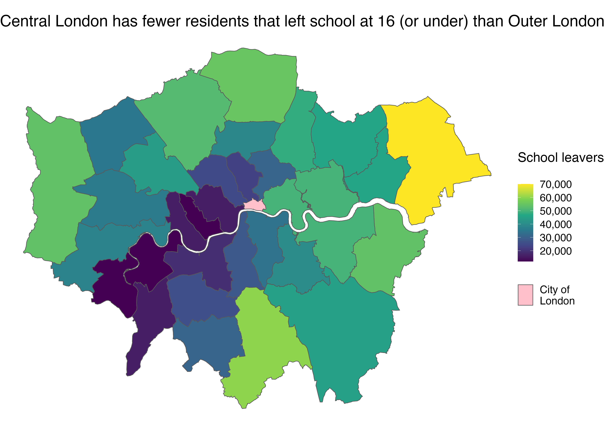
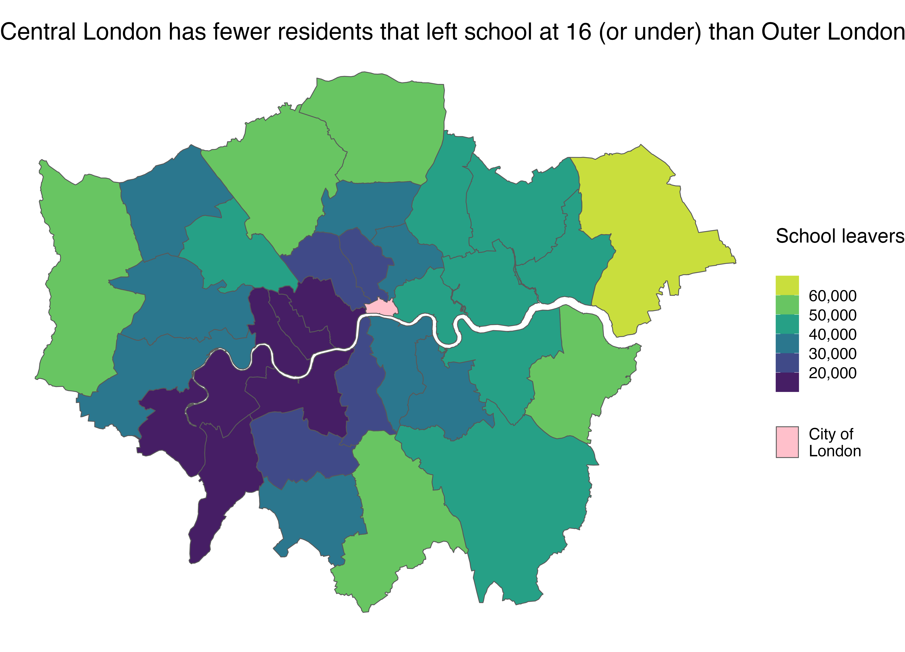

```{r child = "setup.Rmd"}
```

```{r, include=FALSE, eval=TRUE}
library("tidyverse")
library("sf")
library("rnaturalearthdata")
library("maps")
library("here")
library("ggspatial")
library("janitor")
library("readxl")
library("tidygeocoder")
library("ggspatial")
library("leaflet")
library("ggrepel")
library("scales")
library("fontawesome")
library("rmapshaper")
library("tigris")
library(tidycensus)
colours_ggplot2_components <- as.list(set_names(ggpomological:::pomological_palette[1:5], c("aesthetics", "geoms", "scales", "guides", "themes")))

us_states <- states() %>% 
  clean_names() %>% 
  mutate(statefp = as.numeric(statefp))

south_atlantic_states <- us_states %>% 
  filter(division == 5) %>% 
  ms_simplify()


prisoners_per_state <- get_decennial(geography = "state",
              variables = c("state_prison_population" = "PCT020006")) %>% 
  clean_names() %>% 
  mutate(state_prison_population = if_else(name == "District of Columbia",
                         NA_real_,
                         value))

options(htmltools.preserve.raw = FALSE)
```

```{r, eval=TRUE, include=FALSE}
london_sf <- read_sf(here("slides", "static-maps-with-ggplot2", "data", "london_boroughs"))

education_data <- read_csv(here("slides", "static-maps-with-ggplot2", "data", "age-when-completed-education.csv"))

london_school_leavers_sf <- london_sf %>% 
  left_join(education_data,
            by = c("lad11nm" = "area")) %>% 
  filter(age_group == "16 or under")
```


class: center, middle, dk-section-title
background-image:url("https://images.pexels.com/photos/7135077/pexels-photo-7135077.jpeg?auto=compress&cs=tinysrgb&dpr=2&h=750&w=1260")
background-size: cover

# Choropleth of continuous variables

---

# Continuous variable choropleth

```{r, include=FALSE}
gg_london_school_leavers_colorbar <- london_school_leavers_sf %>% 
  ggplot() +
  geom_sf(aes(fill = value,
              shape = "City of\nLondon")) +
  scale_fill_viridis_c(na.value = "pink",
                       labels = scales::number_format(scale = 1, big.mark = ","),
                       name = "School leavers\n") +
  guides(shape = guide_legend(override.aes = list(fill = "pink"),
                              order = 2,
                              title = ""),
         fill = guide_colorbar(order = 1)) +
  labs(title = "Central London has fewer residents that left school at 16 (or under) than Outer London") +
  theme_void(base_size = 24) +
  theme(legend.key.height = unit(1, "cm"),
        legend.key.width = unit(1, "cm"))

ggsave(here("slides", "static-maps-with-ggplot2", "images", "gg_london_school_leavers_colorbar.png"),
       gg_london_school_leavers_colorbar)
```

```{r, include=FALSE}
gg_london_school_leavers_binned <- london_school_leavers_sf %>% 
  ggplot() +
  geom_sf(aes(fill = value,
              shape = "City of\nLondon")) +
  scale_fill_viridis_b(na.value = "pink",
                       labels = scales::number_format(scale = 1, big.mark = ","),
                       name = "School leavers\n") +
  guides(shape = guide_legend(override.aes = list(fill = "pink"),
                              order = 2,
                              title = ""),
         fill = guide_colorbar(order = 1)) +
  labs(title = "Central London has fewer residents that left school at 16 (or under) than Outer London") +
  theme_void(base_size = 24) +
  theme(legend.key.height = unit(1, "cm"),
        legend.key.width = unit(1, "cm"))

ggsave(here("slides", "static-maps-with-ggplot2", "images", "gg_london_school_leavers_binned.png"),
       gg_london_school_leavers_binned)
```

.pull-left[
<center>

</center>
]

--

.pull-right[
<center>

</center>
]

---

## NA values and continuous choropleth

.pull-left[
To label NA values in continuous choropleth we need to go through 3 steps:

- Find an unused aesthetic in the chart (the NA aesthetic)

- Override the guide for the NA aesthetic

- Set the `na.value` in the fill scale

]

.pull-right[
<center>

</center>
]

---

### Find an unused <span style='color:`r colours_ggplot2_components$aesthetics`'>aesthetics `r fa(name = "ruler-combined", fill = colours_ggplot2_components$aesthetics)`</span> in the chart

The <span style='color:`r colours_ggplot2_components$guides`'>continuous fill guides</span> **do not have space** for an NA label.

--

We need to create a new <span style='color:`r colours_ggplot2_components$guides`'>guide</span> - which means we need to choose an <span style='color:`r colours_ggplot2_components$aesthetics`'>NA aesthetic</span>

Good choices include:

- shape

- alpha

---

### Override the <span style='color:`r colours_ggplot2_components$guides`'>guide `r fa(name = "tags", fill = colours_ggplot2_components$guides)`</span> for the NA aesthetic

Now that we've created an aesthetic and corresponding guide, we need to override the aesthetics:

```{r}
gg_chart +
  guides(shape = guide_legend(override.aes = list(fill = "pink")))
```

---

### Set the `na.value` in the fill scale

While the continuous fill guides don't have space for a *label* they do allow us to set an `NA` *color*:

```{r}
gg_chart +
  scale_fill_viridis_c(na.value = "pink")
```

---

class: inverse

# Your turn

.pull-left[
Use the `your-turn.R` script in `02_07` to build this map.

You'll need to add a guide item for District of California which has an NA value.

- Create an NA aesthetic

- Override the guide aesthetics

- Set the `na.value` for the fill aesthetic

]

.pull-right[
```{r eval=TRUE, echo=FALSE, message=FALSE, warning=FALSE}


south_atlantic_prisons <- south_atlantic_states %>% 
  left_join(prisoners_per_state)

# ==== SOLUTION ====

gg_south_atlantic_prisonsers <- south_atlantic_prisons %>%
  ggplot() +
  geom_sf(aes(fill = state_prison_population,
              shape = "District of Columbia"),
          color = "white",
          size = 0.1) +
  scale_fill_viridis_c(labels = scales::number_format(big.mark = ","),
                       na.value = "pink") +
  guides(fill = guide_colorbar(order = 1,
                               title = "Prisoners in state prisons"),
         shape = guide_legend(override.aes = list(fill = "pink"),
                              order = 2,
                              title = "")) +
  labs(title = "State prison populations in the South Atlantic US") +
  theme_void()

gg_south_atlantic_prisonsers
```

]


