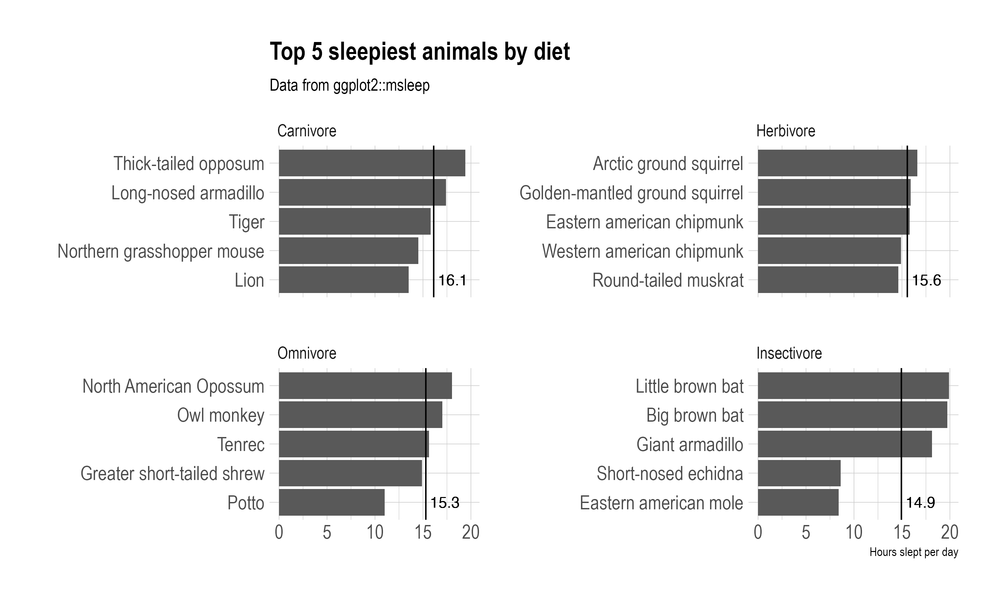
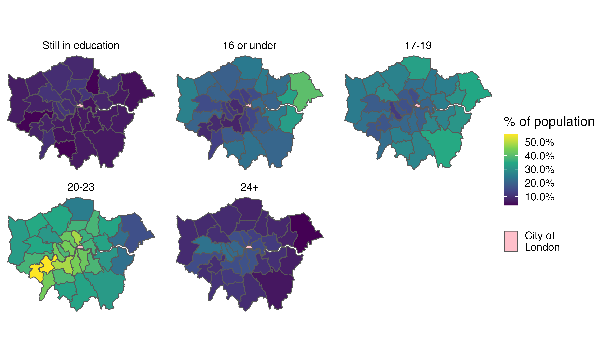
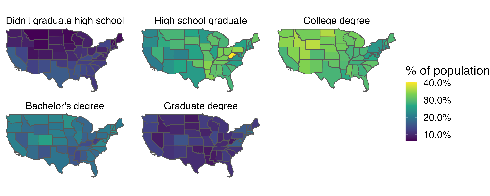

```{r child = "setup.Rmd"}
```

```{r, include=FALSE, eval=TRUE}
library("tidyverse")
library("sf")
library("rnaturalearthdata")
library("maps")
library("here")
library("ggspatial")
library("janitor")
library("readxl")
library("tidygeocoder")
library("ggspatial")
library("leaflet")
library("ggrepel")
library("scales")
library("fontawesome")
library("rmapshaper")
library("tigris")
library(tidycensus)
library(hrbrthemes)
library(palmerpenguins)
colours_ggplot2_components <- as.list(set_names(ggpomological:::pomological_palette[1:5], c("aesthetics", "geoms", "scales", "guides", "themes")))
```


class: center, middle, dk-section-title
background-image:url("https://images.pexels.com/photos/7512498/pexels-photo-7512498.jpeg?auto=compress&cs=tinysrgb&dpr=2&h=750&w=1260")
background-size: cover

# Faceting choropleths

---

# Small multiples

```{r, eval=FALSE, echo=FALSE}
gg_msleep_faceted <- msleep %>% 
  filter(!is.na(vore)) %>% 
  mutate(vore = case_when(vore == "carni" ~ "Carnivore",
                          vore == "herbi" ~ "Herbivore",
                          vore == "insecti" ~ "Insectivore",
                          vore == "omni" ~ "Omnivore")) %>% 
  group_by(vore) %>% 
  slice_max(sleep_total, n = 5) %>% 
  mutate(mean_sleep = mean(sleep_total, na.rm = TRUE)) %>% 
  ungroup() %>% 
  mutate(vore = fct_reorder(vore, mean_sleep),
         vore = fct_rev(vore)) %>% 
  ggplot(aes(x = sleep_total,
             y = fct_reorder(name, sleep_total))) +
  geom_col() +
  geom_vline(aes(xintercept = mean_sleep)) +
  geom_text(aes(x = mean_sleep + 2,
                label = round(mean_sleep, 1),
                y = 1)) +
  facet_wrap(~ vore, scales = "free_y") +
  labs(title = "Top 5 sleepiest animals by diet",
       subtitle = "Data from ggplot2::msleep",
       y = "",
       x = "Hours slept per day") +
  theme_ipsum(base_size = 14)

ggsave(here("slides", "static-maps-with-ggplot2", "images", "gg_msleep_faceted.png"),
       gg_msleep_faceted,
       width = 10,
       height = 6)

```

.pull-left[
Small multiples is a very popular data visualisation technique.

It allows readers to compare data across an additional categorical variable.
]

.pull-right[
<center>

</center>
]

---

<center>

</center>

---

# Small multiples with {ggplot2}

In {ggplot2} we can create small multiples via faceting, with either `facet_wrap()` or `facet_grid()`

---

class: my-turn

# My turn

```{r, echo=FALSE, eval=TRUE}
london_sf <- read_sf(here("slides", "static-maps-with-ggplot2", "data", "london_boroughs"))

education_data <- read_csv(here("slides", "static-maps-with-ggplot2", "data", "age-when-completed-education.csv"))

london_school_ages_sf <- london_sf %>% 
  left_join(education_data,
            by = c("lad11nm" = "area"))
```

```{r, echo=FALSE}


london_school_ages_sf %>% 
  group_by(lad11nm) %>% 
  mutate(value = value / sum(value)) 

gg_faceted_london_edu <- london_school_ages_sf %>% 
  group_by(lad11nm) %>% 
  mutate(value = value / sum(value))  %>% 
  mutate(age_group = fct_relevel(age_group, c("Still in education", "16 or under", "17-19", "20-23", "24+"))) %>% 
  ggplot() +
  geom_sf(aes(fill = value,
              shape = "City of\nLondon")) +
  scale_fill_viridis_c(na.value = "pink",
                       labels = scales::percent_format(),
                       name = "% of population") +
  facet_wrap(~ age_group) +
  guides(shape = guide_legend(override.aes = list(fill = "pink"),
                              order = 2,
                              title = ""),
         fill = guide_colorbar(order = 1)) +
  theme_void(base_size = 16)

london_school_ages_sf

ggsave(here("slides", "static-maps-with-ggplot2", "images", "gg_faceted_london_edu.png"),
       gg_faceted_london_edu,
       width = 10,
       height = 6)
```


.pull-left[
I'm going to improve the map from the previous video.

Instead of showing one level of educational achievement the chart now shows the % of the population in each category.
]

.pull-right[
<center>

</center>
]

---

class: inverse

# Your turn

```{r, eval=TRUE, include=FALSE}
us_contiguous <- states() %>% 
  clean_names() %>% 
  mutate(statefp = as.numeric(statefp)) %>% 
  filter(statefp < 60,
         !statefp %in% c(2, 15)) %>% 
  ms_simplify()


education_breakdown <- get_acs(
  geography = "state",
  year = 2019,
  variables = c(
    "Didn't graduate high school" = "B06009_002",
    "High school graduate" = "B06009_003",
    "College degree" = "B06009_004",
    "Bachelor's degree" = "B06009_005",
    "Graduate degree" = "B06009_006"
  )) %>% 
  clean_names() %>% 
  group_by(name) %>% 
  mutate(estimate = estimate / sum(estimate)) %>% 
  rename(education_attainment = variable)

us_education_attainment_sf <- us_contiguous %>% 
  left_join(education_breakdown)

order_of_education <- c("Didn't graduate high school", "High school graduate", "College degree", "Bachelor's degree", "Graduate degree")

gg_us_education_attainment <- us_education_attainment_sf %>% 
  mutate(education_attainment = fct_relevel(education_attainment, order_of_education)) %>% 
  ggplot() +
  geom_sf(aes(fill = estimate)) +
  scale_fill_viridis_c(labels = scales::percent_format(),
                       name = "% of population") +
  facet_wrap(~ education_attainment) + 
  theme_void(base_size = 18)

ggsave(here("slides", "static-maps-with-ggplot2", "images", "gg_us_education_attainment.png"),
       gg_us_education_attainment,
       width = 10,
       height = 4)
```

.pull-left[
Recreate this facetted choropleth from the your-turn.R script of `02_08`.

- Create a vector containing the correct order of educational attainments

- Use fct_relevel() to reorder the facet labels.
]

.pull-right[

]


